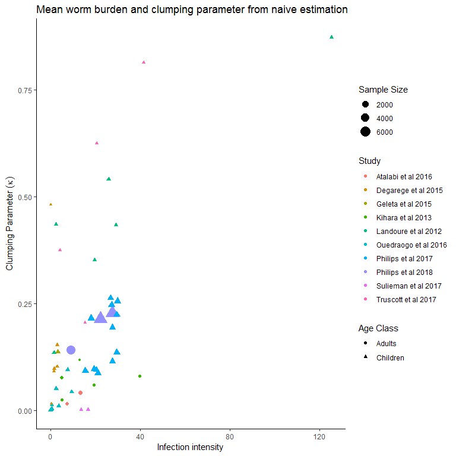
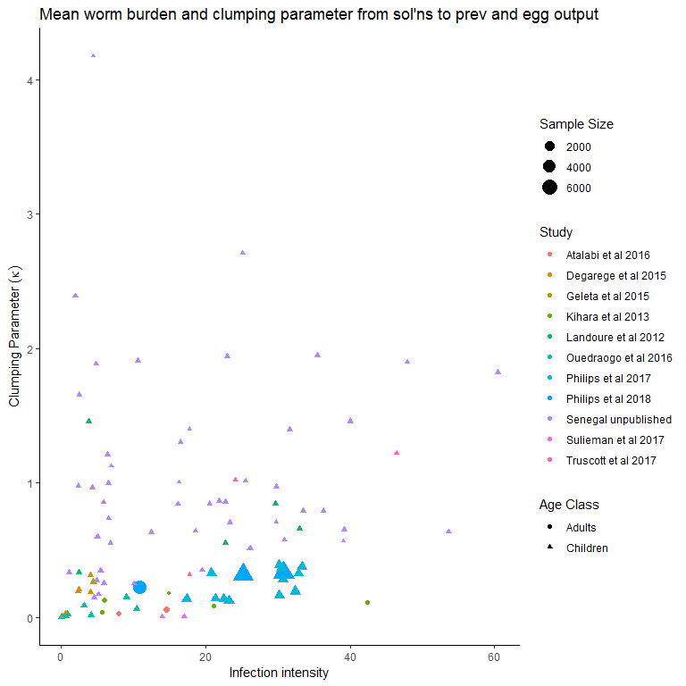
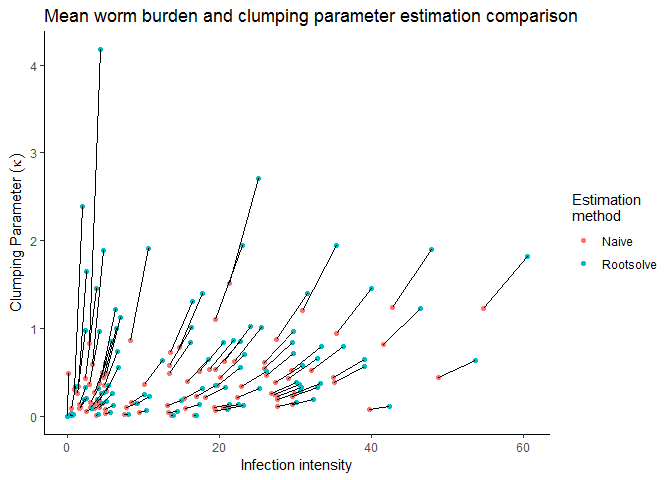
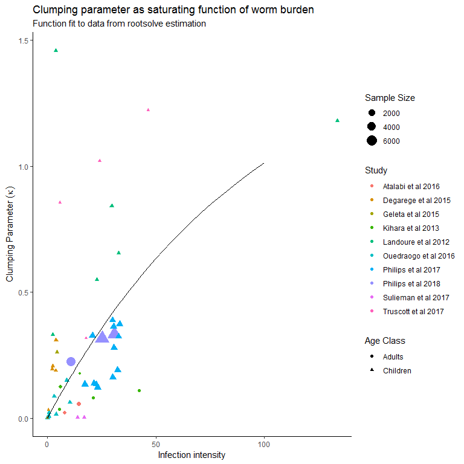
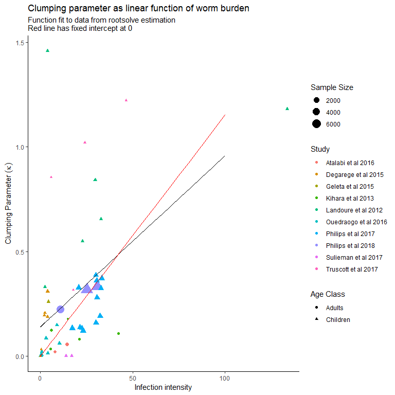
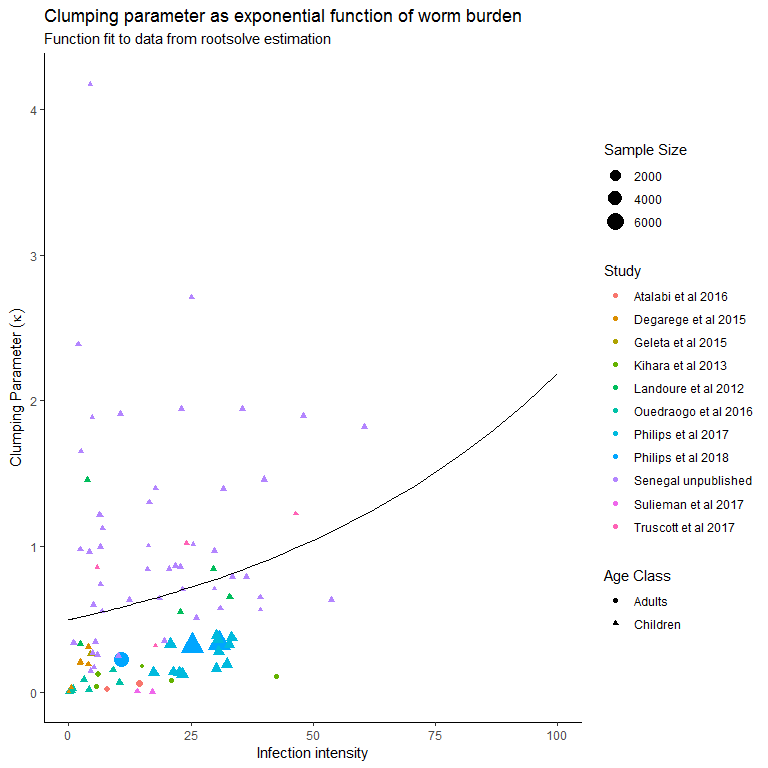
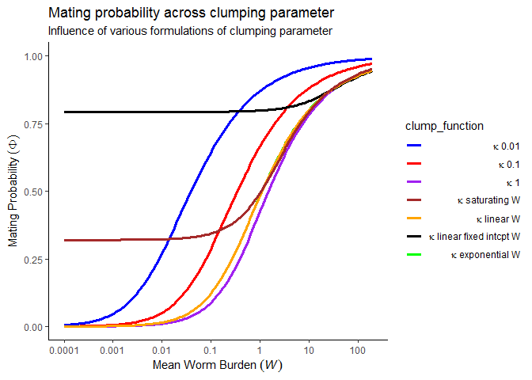

Structural modeling decisions and implications for breakpoint estimation
================

Aggregation parameter of the negative binomial distribution, *κ*
================================================================

The aggregation or clumping parameter describing the distribution of worms amongst individuals in a population is frequently assumed constant, but in reality is likely to change in response to changes in the mean worm burden, *W*. A linear relationship has been suggested and implemented Chan, Guyatt, Bundy, Booth, Fulford, and Medley (1995); é, é, Goita, é, Tuinsma, Sacko, Toubali, French, Keita, Fenwick, é, and Zhang (2012), but does not necessarily have any theoretical foundation.

Clumping parameter as function of infection intensity
-----------------------------------------------------

S. haematobium infection data consisting of egg burden and prevalence estimates were collected from a literature review. We restrict estimation to those studies which report an arithmetic mean egg burden and prevalence estimate

The mean worm burden, *W*, and clumping parameter, *κ*, are estimated as functions of the mean egg burden, ℰ, and prevalence of **signs of infection**, which can be interpreted as the prevalence of mated worm pairs, *Ω*:

%5Crho(W,%5Ckappa,%5Czeta)m)

%5E%7B-k%7D+%5Cbig(1+%5Cfrac%7BW%7D%7B%5Ckappa%7D%5Cbig)%5E%7B-k%7D)

### Naive estimation

Estimate aggregation parameter from egg intensity and prevalence assuming mean worm burden is equivalent to egg burden times 2 (for assumed 1:1 sex ratio) divided by estimate of egg output per mated female worm (assuming no DD fecundity and no mating function)


### Estimation incorporating mating probability

Uses rootsolving to solve for mean worm burden and aggregation from equations for egg output per mated female worm and prevalence of mated pairs

    ## diagonal element is zero 
    ## [1] 2



``` r
fit_pars_from_eggs_prev <- function(pars, intensity, prev){
  
  W <- pars[1]
  kap <- pars[2]
  zeta <- pars[3]
  m <- pars[4]
  
  mate_integral <- function(t){
      (1-cos(t))/((1 + (W/(W + kap))*cos(t))^(1+kap))
  }

  mate_prob <- (1-integrate(mate_integral, 0, 2*pi)$value*((1-(W/(W + kap)))^(1+kap))/(2*pi))


# From equation relating mean egg burden to mean worm burden and clumping parameter
  F1 <- abs(0.5*W*(mate_prob*m*(1 + (1-exp(-zeta))*(W/kap))^(-kap-1))- # Estimate of eggs produced per 10mL urine
    intensity)

# From equation relating prevalence of mated pairs to mean worm burden and clumping parameter
  F2 <- abs(1 - 2*(1+W/(2*kap))^(-kap) + (1+W/kap)^(-kap)-prev)
  
  return(F1+F2)

}

fit_pars_from_eggs_prev(pars = c(W = schisto_dat_filt$Intensity[1]*2/base_pars["m"],
                                 kap = 0.1,
                                 zeta = 0.08,
                                 m = base_pars["m"]),
                        intensity = schisto_dat_filt$Intensity[1],
                        prev = schisto_dat_filt$Prevalence[1])
```

    ##      W.m 
    ## 324.2037

``` r
optim(par = c(W = schisto_dat_filt$Intensity[1]*2,
              kap = 0.1,
              zeta = 0.08,
              m = base_pars["m"]),
      fn = fit_pars_from_eggs_prev,
      intensity = schisto_dat_filt$Intensity[1],
      prev = schisto_dat_filt$Prevalence[1],
      lower = c(1e-6, 1e-6, 0, 1e-6),
      upper = c(1000, 5, 1, 50),
      method = "L-BFGS-B",
      control = list("factr" = 1e10))
```

    ## $par
    ##            W          kap         zeta          m.m 
    ## 651.39945722   1.50718567   0.00241909   5.50568521 
    ## 
    ## $value
    ## [1] 35.73445
    ## 
    ## $counts
    ## function gradient 
    ##       64       64 
    ## 
    ## $convergence
    ## [1] 52
    ## 
    ## $message
    ## [1] "ERROR: ABNORMAL_TERMINATION_IN_LNSRCH"

``` r
w_k_z_m_optim <- t(apply(schisto_dat_filt, 1,
                       function(x){
                         opt_obj <- optim(par = c(W = as.numeric(x["Intensity"])*2,
                                                     kap = 0.1,
                                                     zeta = 0.01,
                                                     m = base_pars["m"]),
                                             fn = fit_pars_from_eggs_prev,
                                             intensity = as.numeric(x["Intensity"]),
                                             prev = as.numeric(x["Prevalence"]),
                                             lower = c(1e-6, 1e-6, 0, 1e-6),
                                             upper = c(1000, 5, 1, 50),
                                             method = "L-BFGS-B",
                                             control = list("factr" = 1e10))
                            
                            return(list(c(opt_obj$par), opt_obj$value, opt_obj$convergence, opt_obj$message))
                       }))

w_k_z_m_optim2 <- t(apply(schisto_dat_filt, 1,
                          function(x){
                            opt_obj <- optim(par = c(W = as.numeric(x["Intensity"])*2,
                                                     kap = 0.1,
                                                     zeta = 0.08,
                                                     m = 20),
                                             fn = fit_pars_from_eggs_prev,
                                             intensity = as.numeric(x["Intensity"]),
                                             prev = as.numeric(x["Prevalence"]),
                                             lower = c(1e-6, 1e-6, 0, 1e-6),
                                             upper = c(1000, 5, 1, 50),
                                             method = "L-BFGS-B",
                                             control = list("factr" = 1e10))
                            
                            return(c(opt_obj$par, opt_obj$value, opt_obj$convergence))
                          }))
```

### Estimation incorporating mating probability and fecundity reduction due to crowding

    ## diagonal element is zero 
    ## [1] 2
    ## diagonal element is zero 
    ## [1] 2
    ## diagonal element is zero 
    ## [1] 2
    ## diagonal element is zero 
    ## [1] 2
    ## diagonal element is zero 
    ## [1] 2
    ## diagonal element is zero 
    ## [1] 2
    ## diagonal element is zero 
    ## [1] 2
    ## diagonal element is zero 
    ## [1] 2
    ## diagonal element is zero 
    ## [1] 2
    ## diagonal element is zero 
    ## [1] 2
    ## diagonal element is zero 
    ## [1] 2
    ## diagonal element is zero 
    ## [1] 2
    ## diagonal element is zero 
    ## [1] 2
    ## diagonal element is zero 
    ## [1] 2
    ## diagonal element is zero 
    ## [1] 2
    ## diagonal element is zero 
    ## [1] 2
    ## diagonal element is zero 
    ## [1] 2
    ## diagonal element is zero 
    ## [1] 2
    ## diagonal element is zero 
    ## [1] 2
    ## diagonal element is zero 
    ## [1] 2
    ## diagonal element is zero 
    ## [1] 2
    ## diagonal element is zero 
    ## [1] 2
    ## diagonal element is zero 
    ## [1] 2
    ## diagonal element is zero 
    ## [1] 2
    ## diagonal element is zero 
    ## [1] 2
    ## diagonal element is zero 
    ## [1] 2
    ## diagonal element is zero 
    ## [1] 2
    ## diagonal element is zero 
    ## [1] 2
    ## diagonal element is zero 
    ## [1] 2
    ## diagonal element is zero 
    ## [1] 2
    ## diagonal element is zero 
    ## [1] 2
    ## diagonal element is zero 
    ## [1] 2
    ## diagonal element is zero 
    ## [1] 2
    ## diagonal element is zero 
    ## [1] 2
    ## diagonal element is zero 
    ## [1] 2
    ## diagonal element is zero 
    ## [1] 2
    ## diagonal element is zero 
    ## [1] 2
    ## diagonal element is zero 
    ## [1] 2
    ## diagonal element is zero 
    ## [1] 1
    ## diagonal element is zero 
    ## [1] 2
    ## diagonal element is zero 
    ## [1] 2
    ## diagonal element is zero 
    ## [1] 2
    ## diagonal element is zero 
    ## [1] 2
    ## diagonal element is zero 
    ## [1] 2
    ## diagonal element is zero 
    ## [1] 2
    ## diagonal element is zero 
    ## [1] 2
    ## diagonal element is zero 
    ## [1] 2
    ## diagonal element is zero 
    ## [1] 2
    ## diagonal element is zero 
    ## [1] 2
    ## diagonal element is zero 
    ## [1] 2

    ## diagonal element is zero 
    ## [1] 2
    ## diagonal element is zero 
    ## [1] 2
    ## diagonal element is zero 
    ## [1] 2
    ## diagonal element is zero 
    ## [1] 2
    ## diagonal element is zero 
    ## [1] 2
    ## diagonal element is zero 
    ## [1] 2
    ## diagonal element is zero 
    ## [1] 2
    ## diagonal element is zero 
    ## [1] 2
    ## diagonal element is zero 
    ## [1] 2
    ## diagonal element is zero 
    ## [1] 2
    ## diagonal element is zero 
    ## [1] 2
    ## diagonal element is zero 
    ## [1] 2
    ## diagonal element is zero 
    ## [1] 2
    ## diagonal element is zero 
    ## [1] 2
    ## diagonal element is zero 
    ## [1] 2
    ## diagonal element is zero 
    ## [1] 2
    ## diagonal element is zero 
    ## [1] 2
    ## diagonal element is zero 
    ## [1] 2
    ## diagonal element is zero 
    ## [1] 2
    ## diagonal element is zero 
    ## [1] 2
    ## diagonal element is zero 
    ## [1] 2
    ## diagonal element is zero 
    ## [1] 2
    ## diagonal element is zero 
    ## [1] 2
    ## diagonal element is zero 
    ## [1] 2
    ## diagonal element is zero 
    ## [1] 2
    ## diagonal element is zero 
    ## [1] 2
    ## diagonal element is zero 
    ## [1] 2
    ## diagonal element is zero 
    ## [1] 2
    ## diagonal element is zero 
    ## [1] 2
    ## diagonal element is zero 
    ## [1] 2
    ## diagonal element is zero 
    ## [1] 2
    ## diagonal element is zero 
    ## [1] 2
    ## diagonal element is zero 
    ## [1] 2
    ## diagonal element is zero 
    ## [1] 2
    ## diagonal element is zero 
    ## [1] 2
    ## diagonal element is zero 
    ## [1] 2
    ## diagonal element is zero 
    ## [1] 2
    ## diagonal element is zero 
    ## [1] 2
    ## diagonal element is zero 
    ## [1] 1
    ## diagonal element is zero 
    ## [1] 2
    ## diagonal element is zero 
    ## [1] 2
    ## diagonal element is zero 
    ## [1] 2
    ## diagonal element is zero 
    ## [1] 2
    ## diagonal element is zero 
    ## [1] 2
    ## diagonal element is zero 
    ## [1] 2
    ## diagonal element is zero 
    ## [1] 2
    ## diagonal element is zero 
    ## [1] 2
    ## diagonal element is zero 
    ## [1] 2
    ## diagonal element is zero 
    ## [1] 2
    ## diagonal element is zero 
    ## [1] 2

    ## diagonal element is zero 
    ## [1] 2
    ## diagonal element is zero 
    ## [1] 2
    ## diagonal element is zero 
    ## [1] 2
    ## diagonal element is zero 
    ## [1] 2
    ## diagonal element is zero 
    ## [1] 2
    ## diagonal element is zero 
    ## [1] 2
    ## diagonal element is zero 
    ## [1] 2
    ## diagonal element is zero 
    ## [1] 2
    ## diagonal element is zero 
    ## [1] 2
    ## diagonal element is zero 
    ## [1] 2
    ## diagonal element is zero 
    ## [1] 2
    ## diagonal element is zero 
    ## [1] 2
    ## diagonal element is zero 
    ## [1] 2
    ## diagonal element is zero 
    ## [1] 2
    ## diagonal element is zero 
    ## [1] 2
    ## diagonal element is zero 
    ## [1] 2
    ## diagonal element is zero 
    ## [1] 2
    ## diagonal element is zero 
    ## [1] 2
    ## diagonal element is zero 
    ## [1] 2
    ## diagonal element is zero 
    ## [1] 2
    ## diagonal element is zero 
    ## [1] 2
    ## diagonal element is zero 
    ## [1] 2
    ## diagonal element is zero 
    ## [1] 2
    ## diagonal element is zero 
    ## [1] 2
    ## diagonal element is zero 
    ## [1] 2
    ## diagonal element is zero 
    ## [1] 2
    ## diagonal element is zero 
    ## [1] 2
    ## diagonal element is zero 
    ## [1] 2
    ## diagonal element is zero 
    ## [1] 2
    ## diagonal element is zero 
    ## [1] 2
    ## diagonal element is zero 
    ## [1] 2
    ## diagonal element is zero 
    ## [1] 2
    ## diagonal element is zero 
    ## [1] 2
    ## diagonal element is zero 
    ## [1] 2
    ## diagonal element is zero 
    ## [1] 2
    ## diagonal element is zero 
    ## [1] 1
    ## diagonal element is zero 
    ## [1] 2
    ## diagonal element is zero 
    ## [1] 2
    ## diagonal element is zero 
    ## [1] 2
    ## diagonal element is zero 
    ## [1] 2
    ## diagonal element is zero 
    ## [1] 2
    ## diagonal element is zero 
    ## [1] 2
    ## diagonal element is zero 
    ## [1] 2

    ## diagonal element is zero 
    ## [1] 2
    ## diagonal element is zero 
    ## [1] 2
    ## diagonal element is zero 
    ## [1] 2
    ## diagonal element is zero 
    ## [1] 2

    ## Error in integrate(mate_integral, 0, 2 * pi): the integral is probably divergent

    ## diagonal element is zero 
    ## [1] 2
    ## diagonal element is zero 
    ## [1] 2
    ## diagonal element is zero 
    ## [1] 2
    ## diagonal element is zero 
    ## [1] 2
    ## diagonal element is zero 
    ## [1] 2
    ## diagonal element is zero 
    ## [1] 2
    ## diagonal element is zero 
    ## [1] 2
    ## diagonal element is zero 
    ## [1] 2
    ## diagonal element is zero 
    ## [1] 2
    ## diagonal element is zero 
    ## [1] 2
    ## diagonal element is zero 
    ## [1] 2
    ## diagonal element is zero 
    ## [1] 2
    ## diagonal element is zero 
    ## [1] 2
    ## diagonal element is zero 
    ## [1] 2
    ## diagonal element is zero 
    ## [1] 2
    ## diagonal element is zero 
    ## [1] 2
    ## diagonal element is zero 
    ## [1] 2
    ## diagonal element is zero 
    ## [1] 2
    ## diagonal element is zero 
    ## [1] 2
    ## diagonal element is zero 
    ## [1] 2
    ## diagonal element is zero 
    ## [1] 2
    ## diagonal element is zero 
    ## [1] 2
    ## diagonal element is zero 
    ## [1] 2
    ## diagonal element is zero 
    ## [1] 2
    ## diagonal element is zero 
    ## [1] 2
    ## diagonal element is zero 
    ## [1] 2
    ## diagonal element is zero 
    ## [1] 2
    ## diagonal element is zero 
    ## [1] 2
    ## diagonal element is zero 
    ## [1] 2
    ## diagonal element is zero 
    ## [1] 2
    ## diagonal element is zero 
    ## [1] 2
    ## diagonal element is zero 
    ## [1] 2
    ## diagonal element is zero 
    ## [1] 2
    ## diagonal element is zero 
    ## [1] 2
    ## diagonal element is zero 
    ## [1] 2
    ## diagonal element is zero 
    ## [1] 2
    ## diagonal element is zero 
    ## [1] 2
    ## diagonal element is zero 
    ## [1] 2
    ## diagonal element is zero 
    ## [1] 2
    ## diagonal element is zero 
    ## [1] 2
    ## diagonal element is zero 
    ## [1] 2
    ## diagonal element is zero 
    ## [1] 2
    ## diagonal element is zero 
    ## [1] 2
    ## diagonal element is zero 
    ## [1] 2
    ## diagonal element is zero 
    ## [1] 2
    ## diagonal element is zero 
    ## [1] 2
    ## diagonal element is zero 
    ## [1] 2
    ## diagonal element is zero 
    ## [1] 2
    ## diagonal element is zero 
    ## [1] 2
    ## diagonal element is zero 
    ## [1] 2

So this isn't working for some reason... Let's look at estimates of W and

### Comp results



In general, it appears that the clumping parameter is most affected by including density dependence in the estimation. Kappa tends to increase with this method, as does W to some extent. Also appears W increases somewhat proportionally with its own magnitude (i.e. bigger Ws means bigger differences in W between naive and rootsolve estimations).

### kappa as a non-linear (saturating) function of W



### kappa as a linear function of W



### kappa as an exponential function of W



Implications for mating probability
-----------------------------------



So if the clumping parameter approaches 0 as the worm burden approaches 0 (as with the saturating function, brown line above, or for a linear function with fixed intercept at *κ*=0, black line above) the mating probability stays quite high even as the worm burden decreases. This could have serious implications for the breakpoint which could only exist at extremely small worm burdens as a result.
