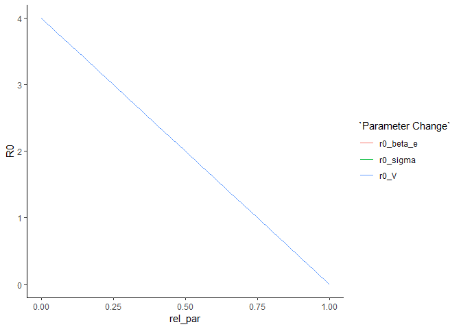
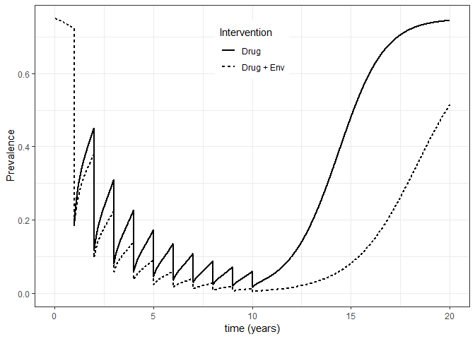
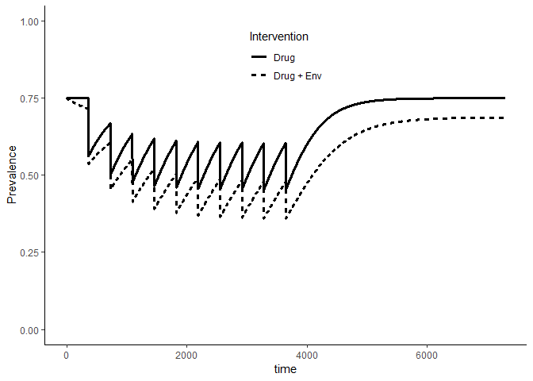
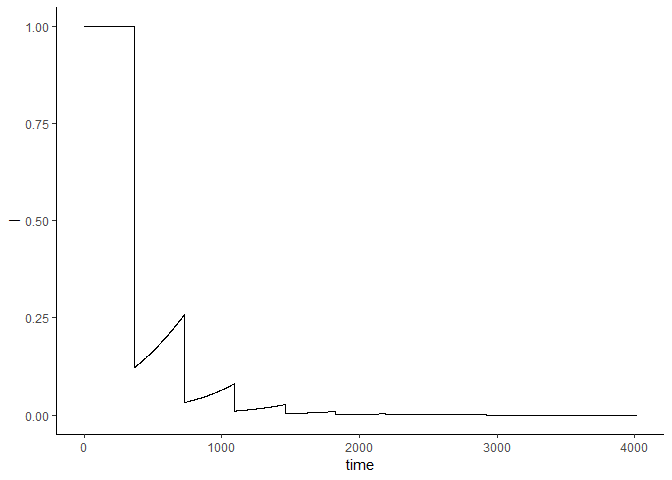

Optimal control of neglected tropical diseases using a simple dynamic model
================
Chris Hoover
May 18, 2018

------------------------------------------------------------------------

Base case: Garchitorena et al simple model
==========================================

Using a simple, generalizable model of NTD transmission presented in [Garchitorena et al](http://rstb.royalsocietypublishing.org/content/372/1722/20160128), two interventions will be considered: 1) drug administration, implemented as a pulse reduction in the state variable, *I*, that reduces the prevalence of the disease in the population and 2) environmental remediation (e.g. improvement in sanitation, vector control), implemented as a permanent alteration of a model parameter, that reduces the transmission of the disease.

The model consists of two state variables, *I* and *W*, that correspond to the prevalence of infection in the human population (i.e. proportion infected at time=*t*) and the degree of contamination of the environment with the disease-causing agent, respectively. We make the simplifying assumption that individuals can only be susceptible, *S*, or infected, *I*, meaning *S* + *I* = 1 and eliminating the need for a recovered *R* compartment as is typical of SIR models but would complicate things here. The model equations then are:

$$\\frac{dI}{dt}=(\\beta\_EW+\\beta\_DI)(1-I)-\\gamma I $$

$$\\frac{dW}{dt}=\\Omega+V\\sigma\\lambda I-\\rho W $$

For most environmentally mediated infectious diseases, transmission to humans is exclusively from the environment and there is no exogenous production of infectious agents in the environment (i.e. *Ω* = 0 and *β*<sub>*D*</sub> = 0. We can derive *R*<sub>0</sub> for this system quite simply since transmission is only determined by the environmental component:

$$R\_0=\\frac{V\\sigma\\lambda\\beta\_E}{\\gamma\\delta}$$

with parameter definitions and values in table 1, we have *R*<sub>0</sub>≈ 4

Effects of parameter changes on *R*<sub>0</sub>
-----------------------------------------------

Even within this simple model, we have a alot of options for simulating different interventions. Drug mased treatments in the human population can be implemented as instantaneous reductions in *I*, improvements in sanitation or education that reduces environmental contamination can be modeled as reductions in variable *σ*, education may also reduce transmission from environment to people (e.g. people learn to avoid exposure) modeled as reductions in *β*<sub>*E*</sub>, vector control or intermediate host control can be modeled as a temporary reduction in parameter *V* or as an instantaneous reduction in state variable *W*. Let's see how some of these parameter changes affect *R*<sub>0</sub>

``` r
#vector of relative parameter reductions
rel_par_reds <- seq(0,1,0.05)

#Function to estimate r0 with change in parameter value
est_r0_change_par <- function(pars, par_change, change_amount){
  pars_use <- pars
  pars_use[par_change] <- pars_use[par_change]*(1-change_amount)
  
  garch_r0(pars_use)
}

#Estimate r0 with relative changes in parameter reductions
garch_r0_pars <- data.frame(rel_par = rel_par_reds,
                            r0_beta_e = map_dbl(rel_par_reds, est_r0_change_par, 
                                                pars = garch_pars,
                                                par_change = "beta_e"),
                            r0_sigma = map_dbl(rel_par_reds, est_r0_change_par, 
                                               pars = garch_pars,
                                               par_change = "sigma"),
                            r0_V = map_dbl(rel_par_reds, est_r0_change_par, 
                                           pars = garch_pars,
                                           par_change = "beta_e"))

garch_r0_pars %>% 
  gather("Parameter Change", "R0", r0_beta_e:r0_V) %>% 
  ggplot(aes(x = rel_par, y = R0, col = `Parameter Change`)) +
    geom_line() +
    theme_classic()
```



Should've seen that one coming actually, since all of these parameters are in the same place in the *R*<sub>0</sub> expression, relative changes in each will have the same affect on *R*<sub>0</sub>. So the true question here is what is the cost of reducing each?

MDA Intervention
----------------

Now want to investigate dynamics under a routine MDA campaign with and without an accompanied environmental intervention such as a reduction in the vector/intermediate host population

``` r
#Get equilibrium estimates for state variables
garch_eq <- runsteady(y = c(I = 0.5, W = 20), func = DDNTD::garch_mod,
                      parms = DDNTD::garch_pars)[["y"]]

#Events representing interventions to implement in the model
n_years <- 20                  #Simulate 10 years of annual intervention
drug_efficacy <- 0.75            #75% reduction in prevalence at each drug treatment
run_time <- c(1:(365*n_years)) #Run model for 10 years

#data frame with event times for drug administration
drugs <- data.frame(var=rep('I', times = n_years/2),
                    time = c(1:(n_years/2))*365,
                    value = rep((1-drug_efficacy), times = n_years/2),
                    method = rep("mult", times = (n_years/2)))
    
#Run model with annual drug administration intervention
drug_only <- sim_garch_mod(garch_eq, run_time, garch_mod, garch_pars,
                           events_df = drugs)

#Reduce vector/intermediate host population
pars_env <- garch_pars
pars_env["V"] <- garch_pars["V"] * 0.8 

#Run model with annual drug administration and environmental intervention 
drug_env <- sim_garch_mod(garch_eq, run_time, garch_mod, pars_env,
                           events_df = drugs)

#Plot results
rbind(drug_env, drug_only) %>% 
  mutate(Intervention = c(rep("Drug + Env", length(run_time)),
                          rep("Drug", length(run_time)))) %>% 
  ggplot(aes(x = time/365, y = I, lty = Intervention)) + 
    theme_bw() + theme(legend.position = c(0.5,0.85)) +
    geom_line(size = 0.75) + xlab("time (years)") + ylab("Prevalence") + ylim(c(0,0.75))
```



Clear that the combined intervention performs better, but in a resource constrained environment, how do we determine where to allocate resources?

Optimal control framework
=========================

Translate the model into a Markov Decision Process (MDP) solvable with stochastic dynamic programming (SDP)
-----------------------------------------------------------------------------------------------------------

Next we want to translate our system of continuous time differential equations into a Markov Decision Process (MDP) consisting of **1)** a Markov chain in which the state of the system at time *t* + 1 is dependent only on the current state of the system (i.e. the state at *t*) and **2)** a decision or control action that is being made at each state transition (i.e. from *t* to *t* + 1). We therefore want a single, discrete time equation that captures about the same dynamics of our simple disease system.

We'll start with the assumption that the dynamics of the infectious agents in the environment are faster than the dynamics of the prevalence in the human population, therefore they reach a steady state equilibrium:
$$W^\*=\\frac{V\\sigma\\lambda I}{\\rho}$$
 Again, substituting we get:
$$\\frac{dI}{dt}=\\Big(\\frac{\\beta\_EV\\sigma\\lambda I}{\\rho}\\Big)\\Big(1-I\\Big)-\\gamma I $$

which can be translated to a discrete time model as:
$$I\_{t+1}=I\_t+\\Big(\\frac{\\beta\_EV\\sigma\\lambda I}{\\rho}\\Big)\\Big(1-I\_t\\Big)-\\gamma I\_t $$
 let's check to make sure that the dynamics of the continuous time model hold in this simplified, discrete time version of the model.

``` r
discrete_sim <- sim_discrete_mod(I_0 = 0.75,
                                 time = max(run_time),
                                 parameters = garch_pars,
                                 events_df = drugs) %>% 
  mutate(Intervention = "Drug")

discrete_env_sim <- sim_discrete_mod(I_0 = 0.75,
                                     time = max(run_time),
                                     parameters = pars_env,
                                     events_df = drugs) %>% 
  mutate(Intervention = "Drug + Env")

bind_rows(discrete_sim, discrete_env_sim) %>% 
  ggplot(aes(x = t, y = I, lty = Intervention)) +
    theme_classic() + 
    theme(legend.position = c(0.5,0.85)) +
    geom_line(size = 1.2) + 
    labs(x = "time", y = "Prevalence") +
    ylim(c(0,1))
```



Now we'll work through the "Six steps of stochastic dynamic programming" as described in [Marescot et al](https://besjournals.onlinelibrary.wiley.com/doi/full/10.1111/2041-210X.12082) to get our MDP and set ourselves up for optimization

1.  **Define the optimization objective of the problem.**
    Our objective is to minimize the costs, *C*, associated with 1) infection of individuals and 2) implementing interventions to reduce their infections

2.  **Define the set of states that represent the configuration of the system at time *t***
    We define the state variable, *X*<sub>*t*</sub>, as the prevalence of infection in the human population, *I*<sub>*t*</sub> ∈ \[0, 1\].

3.  **Define the decision variable, *A*<sub>*t*</sub> that is the component of the system to be controlled to meet the objective**
    We define the decision variable *A*<sub>*t*</sub> as the proportion of capital, *M*, committed to drug administration with the rest allocated towards environmental interventions.

4.  **Build a transition model describing the system's dynamics as a function of the decision variable and the system state in the prior time step**
    Beginning with the discrete time model above, we have:
    $$I\_{t+1}=I\_t+\\Big(\\frac{\\beta\_EV\\sigma\\lambda I}{\\rho}\\Big)\\Big(1-I\_t\\Big)-\\gamma I\_t $$
     Incorporating interventions based on our decision variable, *A*<sub>*t*</sub> gives us:
    $$I\_{t+1}=I\_t+\\Big(\\frac{\\beta\_EV\\sigma\\lambda IM(1-A\_t)\\mu}{\\rho}\\Big)\\Big(1-I\_t\\Big)-I\_t(\\gamma+MA\_t\\theta) $$
     Where *θ* is a constant that converts capital, *M*, to units of prevalence and *μ* is a constant that converts *M* to the same units as the parameter being intervened on with possibilities being *β*<sub>*E*</sub>, *V*, *σ*.

5.  **Define the utility function *U*<sub>*t*</sub>(*X*<sub>*t*</sub>, *A*<sub>*t*</sub>) representing the desirability of acting in a given state**
    $$\\max\_{A}C=\\max\_{A}\\sum\_0^T\\frac{{-\\Pi(I\_t)}}{\\delta\_t}$$
     where *Π*(*I*<sub>*t*</sub>)=*d**I*<sub>*t*</sub> + *M*, *d* is the cost associated with having prevalence of *I*<sub>*t*</sub> and *M* is the capital spent on intervention. We assume capital spent each year is the same and therefore only consider the cost of infection, *d**I*<sub>*t*</sub>. We're also maximizing the negative costs, aka minimizing the costs here.

6.  **Determine the optimal solution of the optimization problem**
    Step 6 is Part 3 below

Part 3: Find the optimal solution using SDP in the `MDPtoolbox` R package
-------------------------------------------------------------------------

Let's translate the problem outlined above into code, borrowing from the wolf culling example in [Marescot et al.](https://doi.org/10.1111/2041-210X.12082) We also want to define some new parameters that control how the interventions act in the model. For MDA, we'll assume that if all capital is devoted to MDA, we get an instantaneous 75% reduction in prevalence (pretty ambitious, but in the realm of possibility). For the environmental intervention, we'll parameterize the effect based on the conversion parameter, *μ*, depending on the parameter we choose to target (*β*<sub>*E*</sub>, *V*, *σ*), therefore we actually have three different parameters, *μ*<sub>*β*<sub>*E*</sub></sub>, *μ*<sub>*V*</sub>, *μ*<sub>*σ*</sub>.

``` r
#Vector of all possible states, i.e. prevalence ranging from 0 to 1  
states <- seq(0.01, 1, 0.01)

#Vector of possible actions, A_t, ranging from total investment in drugs (M=1) 
#  to total investment in environmental intervention (M=0)  
A <- seq(0, 1, 0.01)

#Intervention costs, available capital, and conversion parameters
H <- 1000      # number of people
M <- 1.5*H     # available capital, here modeled as $1.50 per person

mda_cost <- 1.71 # Cost per person for community-wide MDA from Lo et al 2018 PNAS

V_cost <- 400    # Cost for an average annual 10% (mu_V) reduction in vector/intermediate host abundance, loosely based on Lo et al 2018 PNAS
mu_V <- 0.1

mu_beta_e <- NA #TBD
mu_sigma <- NA #TBD

#Parameters for the model and utility function: 
mdp_pars <- c(garch_pars, 
              "d" = 100,      # Arbitrary cost of having prevalence of I_t
              "M" = M,        # Capital available to spend on MDA
              "theta" = (1/H)*(1/mda_cost), # Scaling of capital spent on MDA to reduction in prevalence, 
              "mu" = mu_V/V_cost,    # Scaling of environmental intervention to cost (impact per cost)
              "delta" = 0.9)  #Arbitrary discounting rate  

#Initialize transition matrix across I states and A actions
transition <- array(0, dim = c(length(states), length(states), length(A)))

# Initialize utility matrix
utility <- array(0, dim = c(length(states), length(A)))
```

``` r
# Fill in the transition and utility matrices
# Loop on all states 
for (i in 1:length(states)) {

    # Loop on all actions
    for (a in 1:length(A)) {

# Calculate the transition state at the next step, given the current state i and the intervention, a
        nextpop <- round(sim_int_choice(A_t = A[a], 
                                        I_0 = states[i],
                                        int_par = "V",
                                        time = 365,
                                        parameters = mdp_pars), 2)
        nextind <- pmatch(nextpop, states) #replace which[] with pmatch to ensure proper indexing
        
#Since this model is deterministic, assign probability of 1 to value of I_t+1, everything else =0       
        transition[i, nextind, a] <- 1

# Compute utility as exponentially increasing function of prevalence
    # Implying higher prevalence values are increasingly worse
        utility[i,a] <- -mdp_pars["d"]*nextpop^2

    } # end of action loop
} # end of state loop

#Check that transition and utility matrices are valid
mdp_check(transition, utility)
```

    ## [1] ""

Now we have the transition and utility matrices. The transition matrix indicates for a given starting prevalence, *I*<sub>*t*</sub>, and action *A*<sub>*t*</sub>, the probability of the state at *I*<sub>*t* + 1</sub>. Since this model is deterministic, the transition matrix contains a whole bunch of 0s and some 1s that indicate the value *I*<sub>*t* + 1</sub>|*I*<sub>*t*</sub>, *A*<sub>*t*</sub>. Future models will incorporate stochasticity in transmission to spread the probability around. The utility matrix simply represents the utility of each action, *A*<sub>*t*</sub> applied to each starting prevalence, *I*<sub>*t*</sub>.

We then use the `MDPtoolbox::mdp_finite_horizon` function to identify the optimal policy for each starting condition. This function returns a list with three elements:
\* The valuation matrix, **V**, in which rows represent starting states, columns represent the time steps at which actions occur, and cell values indicate the value of the objective function
\* The policy matrix, **P**, in which rows again represent starting states, columns again represent the time steps at which actions occur, and cell values indicate the *index* of the decision vector (i.e. if the cell value is 50, the optimal decision variable at time step \[column\] for starting state \[row\] is the 50th entry of the decision vector)

``` r
#optimize over 10 years
t_opt <- 10

#Get optimal intervention strategies
opt1 <- mdp_finite_horizon(transition, utility, 
                           mdp_pars["delta"], t_opt)

#Implement example optimal intervention
opt_p50 <- sim_opt_choice(A_vec = A,
                          opt_list = opt1,
                          states = states,
                          p_start = 100,
                          t_per_step = 365,
                          int_par = "V",
                          parameters = mdp_pars)

opt_p50 %>% 
  ggplot(aes(x = time, y = I)) +
    geom_line() + 
    theme_classic() +
    ylim(c(0,1))
```


