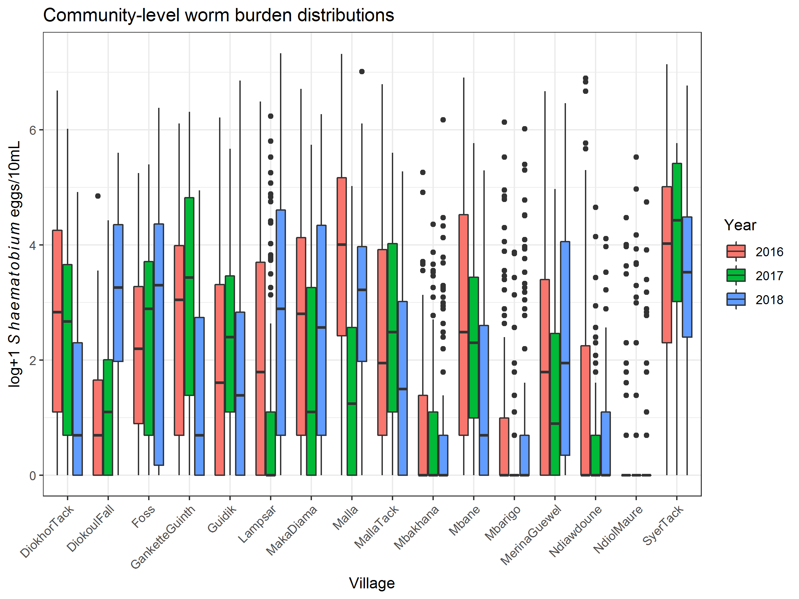

```{r setup, include=FALSE}
knitr::opts_chunk$set(echo = TRUE)

require(tidyverse)
require(viridis)
require(knitcitations)
  #cleanbib()
  cite_options(cite.style = "numeric",
               citation_format = "pandoc")

comm_haem_sums <- read_rds("../../data/senegal_community_haematobium_summaries.rds")  
  devtools::load_all()
  
```

## Critical transitions general theory  
Critical transitions thought of in terms of a general process describing a state variable, $x$:
$$X(t+1)=f(X(t),\theta)Z(t)C(t)$$
where X is the state of the system, $f(X(t),\theta))$ describes the deterministic part of the system, $Z(t)$ describes stoachstic variability in the system, and C(t) describes system controls. Changes in $\theta$ can move the system closer to a threshold where a transition is likely to occur. In a disease setting, particularly for parasitic diseases where transmission is a function of infection intensity, $f(X(t),\theta)\approx R_{eff}$, $\theta\approx R_0$, $X(t)\approx W$ (system state = infection intensity), and $Z(t)$ is related to stochastic components and sources of uncertainty in the system including random egg shedding, susceptibility, unkown inputs from external sources, and diagnostic uncertainties.

### Relevance and application to NTD control and elimination  
Methods for detecting "early warning signals" of critical transitions abound and typically draw from the theory that the rate of return to an equilibirum is decreased as the system approaches a transition (i.e. perturb an unstable system far from the equilibrium and it takes a long time to return). This can be measured e.g. via increased autocorrelation in dense time series. 

This also implies that systems that return rapidly to the pre-purturbation equilibrium are very stable and are far from a critical transition. Persistent hotspot phenomena in which community infection intensities return to pre-treatment levels even before the next treatment can be thought of as a highly stable system, far from a critical transition. This is why perturbations to the system (MDA) have little long term impact. Communities with lower bounce back rates are less stable and therefore take longer to return to their endemic (pre-treatment) equilibirum. This implies lower transmission potential, here embodied by $R_0$.

Rebound can be measured by the bounce back rate, $BBR$, an empirical estimator of $R_{eff}$. It is expected to be high in areas with conditions suggestive of a high $R_0$, indicative of a stable system far from a tipping point. This could be tested in an empirical statistical model with sufficient data pertaining to the determinants of $R_0$ through time and longitudinal measurement of $BBR$. For instance, Spear et al `r citet("10.3390/tropicalmed2030035")` express $R_0$ in terms of invariant biological components of schistosomiasis transmission, $P_b$, and site-specific parameters related to the behavioral and environmental determinants of transmission, $P_s$. Parameters included in $P_s$ relate to human water contact, uninfected snail density, contamination behaviors related to sanitation, the amount of snail habitat, the amount of surface water, and seasonally varying factors such as temperature, rainfall, vegetation indices, and seasonal water contact patterns.


## General model of helminth parasite transmission       
We can connect this to a simplified helminth model similar to those presented previously with two state variables: infection in the environmental reservoir, $y$, (e.g. snail infection for schistosomiasis) and the mean parasite burden in the definitive human host population, $W$, assumed to be negative binomially distributed with dispersion parameter,$\kappa$:
\begin{equation}
\frac{dW}{dt}=\alpha y-\mu_WW 
\end{equation}

\begin{equation}
\frac{dy}{dt}=\beta 0.5W\Phi(W,\kappa)\rho(W,\kappa,\gamma)-\mu_yy  
\end{equation}

Where $\Phi(W,\kappa)$ and $\rho(W,\kappa,\gamma)$ represent density dependent mating probability and reductions in fecundity, respectively, and $0.5W$ accounts for the assumed 1:1 sex ratio of male to female worms. We can use equilibrated reservoir infection, $y^*=\frac{\beta W\Phi(W,\kappa)\rho(W,\kappa,\gamma)}{2\mu_y}$ to reduce the worm burden equation to:

\begin{equation}
\frac{dW}{dt}=\frac{\alpha\beta W\Phi(W,\kappa)\rho(W,\kappa,\gamma)}{2\mu_y}-\mu_WW 
\end{equation}

which can be expressed in terms of the basic reproduction number, $R_0=\frac{\alpha\beta}{2\mu_y\mu_W}$, as:  

\begin{equation}
\frac{dW}{dt}=\mu_WW\big(R_0\Phi(W,\kappa)\rho(W,\kappa,\gamma)-1\big)\label{eq:dw_r0}
\end{equation}

Or in terms of the effective reproduction number, $R_{eff}=R_0\Phi(W,\kappa)\rho(W,\kappa,\gamma)$, as: 

\begin{equation}
\frac{dW}{dt}=\mu_WW\big(R_{eff}(W)-1\big)\label{eq:dw_reff}
\end{equation}

### Initial simulations  
We can frame this simple model as a discrete process with stochasticity, $Z(t)$, related to measurement error of $W(t)$ since we only observe its proxy, $\mathcal{E}(t)$, and control variable $C(t)$ which simulates MDA interventions  

\begin{equation}
W(t+1)=R_{eff}(W(t))Z(t)C(t)\label{eq:dw_discrete}
\end{equation}

We don't know what the function $R_{eff}(W(t))$ is, though theory tells us that it is unimodal, which produces two stable equilibria ($R_{eff}=1$), one at endemic equilibrium, $W^*$, one at elimination and an unstable equilibria referred to as the breakpoint, $W_{bp}$.

```{r sim_w_funcs, echo = FALSE}
#Define a couple helper functions
#Function to estimate R0 from equlibrium worm burden and other parameters
  w_get_r0 <- function(w, kap, gam){
    if(is.na(w)){
      return(NA)
    } else {
      return(1/(phi_Wk(w, kap)*rho_Wk(w, gam, kap)))
    }
  }

#Function to estimate R_{eff} from R0, W and DD parameters
Reff_from_R0_W <- function(R0, W, kap, gam){
  Reff <- R0*phi_Wk(W, kap)*rho_Wk(W, gam, kap)

  return(Reff)
}

#Function to estimate prevalence from worm burden and kappa
Prev_from_W_kap <- function(W, kap){
  1-(2*(1+W/(2*kap))^-kap)+(1+W/kap)^-kap
}

#Function to estimate mean egg output from mean worm burden  
get_mean_egg_output <- function(W, kap, gam, m){
  0.5*W*phi_Wk(W, kap)*rho_Wk(W, gam, kap)*m
}

#Function to generate random egg dispersal from worm burden and other parameters  
  w_n_get_e <- function(w, kap, gam, m, n){
    mu = 0.5*w*phi_Wk(w, kap)*rho_Wk(w, gam, kap)*m
    
    return(rnbinom(n, mu = mu, size = kap))
  }


#Function to estimate mean worm burden from input egg burden and parameters
eggs_to_w <- function(eggs, kap, gam = 0.005, m = 10, w_low, w_hi){
  result <- tryCatch(pracma::brentDekker(function(W){
    mate_integral <- integrate(f = function(x, W, kap){(1-cos(x))/((1 + (W/(W + kap))*cos(x))^(1+kap))},
                               lower = 0,
                               upper = 2*pi,
                               stop.on.error = FALSE,
                               W = W, k = kap)$value
    0.5*W*m*((1 + (1-exp(-gam))*(W/kap))^-(kap+1))*(1-((1-(W/(W + kap)))^(1+kap))/(2*pi)*mate_integral)-eggs
  }, a = w_low, b = w_hi)$root, error=function(err) NA)
  
  return(result)
}


#Function to simulate transmission system through time 
sim_w_pars <- function(w_start, pars, t_tot, events){
    # Initiate vector to fill
      w_vec <- vector("numeric", length = t_tot)
      w_vec[1] <- w_start
      
    # Simulate by t_step for total time, implementing events
      for(t in c(1:t_tot)){
        if(t %in% events[["times"]]){
          w_vec[t+1] = (w_vec[t] + pars["mu_W"]*w_vec[t]*(Reff_from_R0_W(pars["R0"], w_vec[t], pars["kap"], pars["gam"])*events[["R0"]][which(events[["times"]] == t)]-1))*events[["w"]][which(events[["times"]] == t)]
        } else {
          w_vec[t+1] = w_vec[t] + pars["mu_W"]*w_vec[t]*(Reff_from_R0_W(pars["R0"], w_vec[t], pars["kap"], pars["gam"])-1)
        }
        
      }
    
    # Convert time series of worm burden to Reff, egg output, worm burden estimate from egg output and prevalence estimates with stochasticity
      Reff_vec = sapply(w_vec, function(w){
        pars["R0"]*phi_Wk(w, pars["kap"])*rho_Wk(w, pars["gam"], pars["kap"])
      })
      
      egg_vec = sapply(w_vec, function(w){
        mean(w_n_get_e(w, kap = pars["kap"], gam = pars["gam"], m = pars["m"], n = pars["n"]))
      })
        
      w_obs_vec <- mapply(function(w, e){
        (2*e)/(phi_Wk(w, pars["kap"])*rho_Wk(w, pars["gam"], pars["kap"])*pars["m"])
      }, w_vec, egg_vec)
      
      prev_vec = 1-(2*(1+w_vec/(2*pars["kap"]))^-pars["kap"])+(1+w_vec/pars["kap"])^-pars["kap"]
    
    # Return time series of worm burden and simulated egg output
      return(data.frame(time = c(0:t_tot),
                        W_tru = w_vec,
                        W_obs = w_obs_vec,
                        R = Reff_vec,
                        E = egg_vec,
                        P = prev_vec))

}

```


### Connection to epidemiological data  
Because adult parasites are harbored in human hosts, their direct measurement is not possible. Measurement of infection intensity therefore relies on detecting viable eggs produced by mated adult female worms and shed in the urine or feces of human hosts. We are therefore only able to observe a proxy of the system state, the mean egg intensity, $\mathcal{E}$, estimated from the model as $\mathcal{E}=0.5W\Phi(W,\kappa)\rho(W,\kappa,\gamma)m$ and from real world data as the empirical mean of individual egg burdens $\frac{1}{n}\sum_{i=1}^n{\mathcal{E}_i}$. This value is typically assumed to follow a negative binomial distribution with dispersion parameter, $\kappa=\frac{\mathcal{E}+\mathcal{E}^2}{var(\mathcal{E})}$, and observed egg burdens are assumed to be a realization of the data generating process $NB(0.5W\Phi(W,\kappa)\rho(W,\kappa,\gamma)m,\kappa)$. The figures below shows sampled mean egg burdens from school-aged children in Senegal over the course of an intervention campaign testing the efficacy of two novel intervention strategies: prawn introductions and vegetation removal. All children receieve two doses of Praziquantel 3 weeks apart following parasitological surveys in 2016, 2017 and 2018.



```{r comm_egg_burdens, echo = FALSE}
comm_haem_sums %>% 
  mutate(base_prev_class = factor(base_prev_class, levels = c("High", "Med", "Low"))) %>% 
  ggplot(aes(x = year, y = epmL_mean, col = school, group = school, lty = Intervention_2018)) +
    geom_line(size = 1.2) +
    geom_point(aes(size = samp_size)) +
    theme_classic() +
    facet_wrap(~base_prev_class) +
    theme(legend.position = "bottom",
          strip.background = element_rect(fill = "black"),
          strip.text = element_text(color = "white")) +
    scale_x_continuous(name = "Study Year",
                       breaks = c(2016, 2017, 2018),
                       labels = c("Y0", "Y1", "Y2")) +
    labs(y = "mean infection intensity (eggs/10mL urine)",
         title = "S. haematobium infection intensity among SAC over time",
         subtitle = "Stratified by high, medium, and low starting prevalence",
         size = "n SAC",
         lty = "Int") +
    guides(col=guide_legend(ncol=4),
           size = guide_legend(ncol = 1),
           lty = guide_legend(ncol = 1))

```

Because $\mathcal{E}$ is a proxy for the system state, $W$, the unmeasured variables $\gamma$ and $m$, the dimensionless negative density dependence parameter and the mean number of eggs per female worm per 10mL urine, respectively, are of paramount importance to the estimation of $W$ and therefore $R_0$. Values of $\gamma$ used in the past range from $0.005$ to $0.08$ `r citet(c("10.1016/j.epidem.2017.02.003", "10.1101/619908"))` and values of $m$ range from $3$ to $30$ `r citet(c("10.1016/j.epidem.2017.02.003", "10.1371/journal.pntd.0006794"))`. Little observational data on either parameter exists, but autopsy data from Cheever et al `r citet("10.4269/ajtmh.1977.26.702")` suggests the relationsip $\log(1+\mathcal{E}_i)=0.748+1.467\log(1+W_{f_i})$, shown in the plot below. Though this relationship implies more eggs produced per female worm with increasing worm burdens, evidence of positive density dependence, the relationship implies $m\approx10$, as indicated by the red dashed line in the plot.

```{r cheev_eggs_to_worms, echo=FALSE}
data.frame(Wf = c(0:40),
           E_Wf = sapply(c(0:40), function(w){
             exp(0.748+1.467*log(1+w))-1
           })) %>% 
  ggplot(aes(x = Wf, y = E_Wf)) +
    geom_line() +
    geom_abline(intercept = 0, slope = 10,
                col = "red", lty = 2) +
    theme_bw() +
    labs(x = expression(W[f]),
         y = expression(E(W[f])),
         title = "Relationship between adult female worms and egg burden (eggs/10mL urine)",
         subtitle = "From Cheever 1977 autopsy studies of infected individuals")
```

With $m=10$, we can next observe the relationship between $\mathcal{E}$ and $W$ across values of the dispersion parameter $\kappa$ and the negative density dependence parameter, $\gamma$. 

```{r w_to_eggs,  echo = FALSE}
w_to_eggs <- expand.grid(W = exp_seq(1e-4, 100, 200),
                         kap = c(0.05, 0.1, 0.5),
                         gam = c(0.005, 0.01, 0.05),
                         m = c(5, 10, 20, 30)) %>% 
  mutate(eggs = mapply(get_mean_egg_output, 
                       W, kap, gam, m))

w_to_eggs %>% 
  mutate(gam2 = factor(gam, labels = c("gamma=0.005", "gamma=0.01", "gamma=0.05")),
         m2 = factor(m, labels = c("m=5", "m=10", "m=20", "m=30"))) %>% 
  ggplot(aes(x = W, y = eggs, col = as.factor(kap))) +
    geom_line() +
    theme_bw() +
    facet_grid(gam2~m2) +
    labs(x = "Mean worm burden (W)",
         y = "Mean egg output (eggs/10mL)",
         title = "Factors affecting mean egg output given mean worm burden",
         col = expression(kappa))
```

We can also look at the product of the two density dependence functions, a key determinant of $R_{eff}$ across values of $\kappa$ and $W$ for $\gamma=0.005$ 

```{r phi_rho_prod}
dd_prod_df <- expand.grid(W = exp_seq(1e-4, 100, 200),
                          kap = seq(0.01, 1, 0.01),
                          gam = 0.005) %>% 
  mutate(dd_prod = mapply(function(W, kap, gam){
    phi_Wk(W, kap)*rho_Wk(W, gam, kap)
  }, W, kap, gam))

dd_prod_df %>% 
  ggplot(aes(x = W, y = kap, fill = dd_prod, z = dd_prod)) +
    geom_tile() +
    theme_classic() +
    scale_x_continuous(trans = "log",
                       breaks = c(1e-3, 0.01,0.1,1,10,100)) +
    scale_fill_viridis(option = "magma") +
    labs(x = "Mean worm burden (W)",
         y = expression(paste("Dispersion parameter (", kappa, ")")),
         title = "Product of density dependence functions over values of kappa and W")

```


Given the range in egg intensities from Senegal of up to $\mathcal{E}\approx150$, $\gamma=0.005$ appears to be the best choice. Now estimate worm burdens from the Senegal egg burdens and then use them to estimate baseline $R_0$.

```{r est_w, echo = FALSE, fig.height=6, fig.width=8}
#Dataframe with baseline E and kappa estimates
comm_haem_baseline <- comm_haem_sums %>% filter(year == 2016) %>% 
  mutate(kap_cat = cut(epmL_disp, breaks = c(0, 0.2, 0.3, 0.5, 0.75)))

#Estimate baseline W from E and kappa
comm_haem_baseline <- comm_haem_baseline %>% 
  mutate(baseline_ws_gam01_m30 = mapply(eggs_to_w, epmL_mean, epmL_disp,
                                        MoreArgs = list(gam = 0.01, m = 30, w_low = 1, w_hi=1000)),
         baseline_ws_gam005_m10 = mapply(eggs_to_w, epmL_mean, epmL_disp,
                                        MoreArgs = list(gam = 0.005, m = 10, w_low = 1, w_hi=1000)),
         baseline_ws_gam01_m20 = mapply(eggs_to_w, epmL_mean, epmL_disp,
                                        MoreArgs = list(gam = 0.01, m = 20, w_low = 1, w_hi=1000)),
         baseline_r0_gam01_m30 = mapply(w_get_r0, baseline_ws_gam01_m30, epmL_disp,
                                     MoreArgs = list(gam = 0.01)),
         baseline_r0_gam005_m10 = mapply(w_get_r0, baseline_ws_gam005_m10, epmL_disp,
                                     MoreArgs = list(gam = 0.005)),
         baseline_r0_gam01_m20 = mapply(w_get_r0, baseline_ws_gam01_m20, epmL_disp,
                                    MoreArgs = list(gam = 0.01)))

comm_haem_baseline %>% 
  ggplot(aes(x = epmL_mean, y = baseline_r0_gam005_m10, col = school, pch = kap_cat, size = samp_size)) +
    geom_point() +
    theme_classic() +
    theme(legend.position = "bottom") +
    labs(x = "mean infection intensity (eggs/10mL urine)",
         y = expression(R[0]~estimate),
         title = "S. haematobium R0 estimates across baseline infection intensity",
         pch = expression(kappa~category),
         size = "n SAC") +
    guides(col=guide_legend(ncol=4),
           pch = guide_legend(ncol = 2),
           size = guide_legend(ncol = 1))
```

From these equilibria estimates, can now generate phase planes for this system across different values of $\kappa$.

```{r phase_planes, echo = FALSE}

Reff_Grid <- expand.grid(R0 = seq(1,6,0.05),
                         W = exp_seq(0.01, 200, 200),
                         kap = c(0.1, 0.25, 0.4, 0.7),
                         gam = 0.005) %>% 
  mutate(Intensity = mapply(get_mean_egg_output, 
                            W, kap, gam,
                            MoreArgs = list(m = 10)),
         Prevalence = mapply(Prev_from_W_kap,
                             W, kap),
         Reff = mapply(Reff_from_R0_W, 
                       R0, W, kap, gam))

Reff_Grid %>% 
  ggplot(aes(x = R0, y = W, fill = Reff, z = Reff)) +
    theme_classic() +
    geom_tile() +
    geom_contour(breaks = 1, col = "white") +
    scale_y_continuous(trans = "log", 
                       breaks = c(0.01, 0.1, 1, 10, 100), 
                       labels = c("0.01", "0.1", "1", "10", "100")) +
    scale_fill_viridis(option = "magma") +
    facet_grid(kap~.) +
    labs(title = "Phase planes of W/R0 relationships across values of dispersion parameter")

```

Can also show how equilibrium estimates for communities with $0.2$< $\kappa$ < $0.3$ map onto this phase plane

```{r phase_plane_w_data, echo = FALSE}
Reff_Grid %>% 
  filter(kap == 0.25) %>% 
  ggplot(aes(x = R0, y = W, fill = Reff, z = Reff)) +
    theme_classic() +
    geom_tile() +
    geom_point(data = comm_haem_baseline %>% filter(kap_cat == "(0.2,0.3]" & school != "DF") %>% mutate(Reff = 1),
               aes(x = baseline_r0_gam005_m10, y = baseline_ws_gam005_m10, col = school)) +
    geom_contour(breaks = 1, col = "white") +
    scale_y_continuous(trans = "log", 
                       breaks = c(0.1, 1, 10, 100), 
                       labels = c("0.1", "1", "10", "100"),
                       limits = c(0.1, 100)) +
    scale_fill_viridis(option = "magma") +
    labs(title = "Phase plane for k~0.25",
         subtitle = "Points indicate estimated endemic equlibrium values for communities \nwith observed k between 0.2 and 0.3")

```

Looks like the root finding estimation for at least one community's endemic equilibrium actually picked up the breakpoint value of $W$ instead, which is problematic... For the sake of progress, going to gloss over this for now

### Initial toy simulation  
```{r toy_sim}
#Function to simulate worm burden through time
  sim_w <- function(w_start, kap, m, gam, mu_W = 1/(4*365),
                    n_ppl, t_tot, t_step, events){
    #Estimate R0 from starting worm burden
      R0 <- w_get_r0(w_start, kap, gam)
    
    # Initiate vector to fill
      w_vec <- vector("numeric", length = t_tot/t_step)
      w_vec[1] <- w_start
    
    # Simulate by t_step for total time, implementing events
      for(t in c(1:t_tot/t_step)){
        if(t %in% events[["times"]]){
          w_vec[t+1] = (w_vec[t] + mu_W*w_vec[t]*(Reff_from_R0_W(R0, w_vec[t], kap, gam)*events[["R0"]][which(events[["times"]] == t)]-1))*events[["w"]][which(events[["times"]] == t)]
        } else {
          w_vec[t+1] = w_vec[t] + mu_W*w_vec[t]*(Reff_from_R0_W(R0, w_vec[t], kap, gam)-1)
        }
        
      }
    
    # Convert time series of worm burden to Reff, egg output,  and prevalence estimates with stochasticity
      Reff_vec = sapply(w_vec, function(w){
        R0*phi_Wk(w, kap)*rho_Wk(w, gam, kap)
      })
      
      egg_vec = sapply(w_vec, function(w){
        mean(w_n_get_e(w, kap = kap, gam = gam, m = m, n = n_ppl))
      })
        
      prev_vec = 1-(2*(1+w_vec/(2*kap))^-kap)+(1+w_vec/kap)^-kap
    
    # Return time series of worm burden and simulated egg output
      return(data.frame(time = c(0:t_tot/t_step),
                        W = w_vec,
                        R = Reff_vec,
                        E = egg_vec,
                        P = prev_vec))
  }

toy_sim <- sim_w(w_start = 50,
                 kap = 0.1,
                 m = 10, gam = 0.005,
                 n_ppl = 500,
                 t_tot = 365*2.2, t_step = 1,
                 events = data.frame(times = c(0:1)*365+30,
                                     w = 0.5, 
                                     R0 = 1))

toy_sim %>% 
  gather("Var", "Val", W:P) %>% 
    ggplot(aes(x = time, y = Val)) +
      geom_line() +
      theme_bw() + 
      facet_grid(Var~., scales = "free_y") +
      scale_x_continuous(breaks = c(0:2)*365,
                         labels = c(0:2),
                         name = "time (yrs)") +
    labs(title = "Key infection variables through time",
         subtitle = "Assuming MDA removes 50% of worm population in treated SAC")


```


### Initial simulation for exaple Senegal community   
Simulate egg burden time series for Diokhor Tack (DT), a community with a relatively predictable response to drug treatment (sustained reductions in egg burden following MDA in both 2016 and 2017) 

```{r init_sim, echo = FALSE}
dt_plot_dat <- comm_haem_sums %>% 
  filter(school == "DT") %>% 
  mutate(time = c(0:2)*364,
         E = epmL_mean,
         P = prev,
         W = mapply(eggs_to_w, epmL_mean, epmL_disp,
                    MoreArgs = list(w_low = 1, w_hi=500))) %>% 
  dplyr::select(time, E, P, W) %>% 
  gather("Var", "Val", E:W)

dt_sim <- sim_w(w_start = comm_haem_baseline %>% filter(school == "DT") %>% pull(baseline_ws_gam005_m10),
                kap = comm_haem_baseline %>% filter(school == "DT") %>% pull(epmL_disp),
                m = 10, gam = 0.005,
                n_ppl = comm_haem_baseline %>% filter(school == "DT") %>% pull(samp_size),
                t_tot = 365*2.2, t_step = 1,
                events = data.frame(times = c(0:1)*365+30,
                                    w = 0.06, 
                                    R0 = 1))

dt_sim %>% 
  gather("Var", "Val", W:P) %>% 
    ggplot(aes(x = time, y = Val)) +
      geom_line() +
      theme_bw() + 
      geom_point(data = dt_plot_dat, 
                 aes(x = time, y = Val),col = "red") +
      facet_grid(Var~., scales = "free_y") +
      scale_x_continuous(breaks = c(0:2)*365,
                         labels = c(0:2),
                         name = "time (yrs)") +
    labs(title = "Key infection variables through time",
         subtitle = "Assuming MDA removes 94% of worm population in treated SAC")
  
```

This looks like a pretty good fit, but everyone in this dataset was treated, so an assumption of 50% worm death is probably pretty far off. The prevalence estimates are also way off, with systematic underestimation of prevalence. I don't think this simple model is capable of capturing the transmission dynamics we want

#### Simulate with no intervention  
```{r sim1, echo = FALSE}
pars1 = c("R0" = 4,
          "kap" = 0.25,
          "gam" = 0.05,
          "m" = 10,
          "mu_W" = 1/(4*365),
          "n" = 1000)

events_none <- data.frame("times" = 1,
                          "R0" = 1,
                          "w" = 1)

sim1 <- sim_w_pars(w_start = 100, pars = pars1, t_tot = 10000, events = events_none)

sim1 %>% 
  ggplot(aes(x = time, y = W_obs)) +
    geom_line() +
    theme_classic() +
    labs(x = "time",
         y = "Measured worm burden, W(t)",
         title = "Base simulation, no intervention")
```

#### Simulate with control events targeting state variable  
```{r sim_staet_var_int, echo = FALSE}
events2 <- data.frame("times" = c(1:3)*300,
                      "R0" = 1,
                      "w" = 0.5)

sim2 <- sim_w_pars(w_start = 100, pars = pars1, t_tot = 10000, events = events2)

sim2 %>% 
  ggplot(aes(x = time, y = W_obs)) +
    geom_line() +
    theme_classic() +
    labs(x = "time",
         y = "Measured worm burden, W(t)",
         title = "State variable intervention with 50% efficacy every 300 days")

```

#### Simulate with control events steadily reducing R0  
```{r r0_int, echo = FALSE}
events3 <- data.frame("times" = seq(10, 10000, 10),
                      "R0" = seq(1, 0.1, length.out = length(seq(10, 10000, 10))),
                      "w" = 1)

sim3 <- sim_w_pars(w_start = 100, pars = pars1, t_tot = 10000, events = events3)

sim3 %>% 
  ggplot(aes(x = time, y = W_obs)) +
    geom_line() +
    theme_classic() +
    labs(x = "time",
         y = "Measured worm burden, W(t)",
         title = "R0 intervention with gradual decline")

```

So these results are not showing what we want them to, but they're also not capturing underlying dynamics well, particularly really rapid rebound to pre-infection levels like we see in lots of annual schisto datasets. This just represents a shortcoming of this simplified model where an $R_0$ high enough to capture rapid reinfection dynamics also implies an unrealistic baseline level of infection. I'm dealing with this via an individual based model that captures individual variability in susceptibility to infection and to exposure. My intuition is that accounting for these heterogeneities will allow for much higher transmission rates, but much lower endemic levels of infection, closer to what we see in the data.

Another option is to turn to simpler generic ecologic models. One suitable model is the Myers model `r citet(c("10.1126/science.269.5227.1106", "10.1098/rspb.2014.1631"))` commonly used in fisheries science:  

\begin{equation}
dW=\frac{rW^\theta}{1+W^\theta/K}
\end{equation}

```{r myers_sim, echo = FALSE}
myers <- function(W, pars){
  (pars["r"]*W^pars["theta"])/(1+W^pars["theta"]/pars["K"]) - W*pars["mu"]
}

sim_myers <- function(W_init, pars, t_sim){
  w_fill <- numeric(length = t_sim)
  w_fill[1] <- W_init
  
  for(t in 2:t_sim){
    w_fill[t] <- w_fill[t-1] + myers(w_fill[t-1], pars)
  }
  
  return(w_fill)
  
}

myers_pars <- c("r" = 0.1,
                "K" = 10,
                "theta" = 1.5,
                "mu" = 1/(4*365))

data.frame("W" = exp_seq(1e-4, 100, 1000)) %>% 
  mutate(dW = sapply(W, myers, pars = myers_pars)) %>% 
  ggplot(aes(x = W, y = dW)) +
    geom_line() +
    theme_classic() +
    labs(x = "W", y = "dW",
         title = "Myers model",
         subtitle = expression(paste("r = 0.1, K = 10, ", theta, " = 1.5 ", mu, " = 4 years")))

data.frame(time = c(1:1000),
           W = sim_myers(1000, myers_pars, 1000)) %>% 
  ggplot(aes(x = time, y = W)) +
    geom_line() +
    theme_classic()
```


## References  
`r write.bibtex(file = "crit_trans.bib")`
