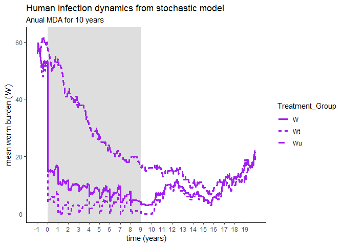

Model Simulations
================
Chris Hoover
June 21, 2019

Initial Simulations and Checks
==============================

Test dynamic simulation through time
------------------------------------

``` r
#Base time and starting values for state variables
base_start <- c(S=5000, E=0, I=0, Wt=10, Wu=10)
years <- 20
base_time <- c(0:(365*years))

#Run to equibrium with base parameter set
base_eqbm <- runsteady(y = base_start, func = DDNTD::schisto_base_mod,
                       parms = DDNTD::base_pars)[["y"]]

#simulate annual MDA 
eff = 0.93 #93% efficacy
base_pars["cvrg"] <- 0.8

mda.events = data.frame(var = rep('Wt', years/2),
                        time = c(1:(years/2))*365,
                        value = rep((1 - eff), years/2),
                        method = rep('mult', years/2))

schisto_base_sim <- sim_schisto_mod(nstart = base_eqbm, 
                                    time = base_time, 
                                    model = schisto_base_mod,
                                    parameters = base_pars,
                                    events_df = mda.events)
```

    ## Warning in if (is.na(events_df)) {: the condition has length > 1 and only
    ## the first element will be used

``` r
schisto_base_sim %>% 
  gather("Snail_Infection", "Density", S:I) %>% 
    ggplot(aes(x = time, y = Density, col = Snail_Infection)) +
      geom_line(size = 1.2) +
      scale_color_manual(values = c("S" = "green",
                                    "E" = "orange",
                                    "I" = "red")) +
      theme_classic() +
      ggtitle("Snail infection dynamics", 
              subtitle = paste0("Anual MDA for ", years/2, " years"))
```


``` r
schisto_base_sim %>% 
  mutate(W = Wt*base_pars["cvrg"] + Wu*(1-base_pars["cvrg"])) %>% 
  gather("Treatment_Group", "Worm_Burden", Wt:W) %>% 
    ggplot(aes(x = time, y = Worm_Burden, lty = Treatment_Group)) +
      geom_line(size = 1.2, col = "purple") +
      scale_linetype_manual(values = c("W" = 1,
                                       "Wt" = 2,
                                       "Wu" = 3)) +
      scale_x_continuous(breaks = c(0:years)*365,
                         labels = c(0:years)) +
      theme_classic() +
      ggtitle("Human infection dynamics", 
              subtitle = paste0("Anual MDA for ", years/2, " years"))
```


Simulate stochastic model
-------------------------

``` r
set.seed(10)
schisto_stoch_sim <- sim_schisto_stoch_mod(nstart = round(base_eqbm),
                                           params = as.list(base_pars),
                                           tf = max(base_time),
                                           events_df = mda.events) %>% 
  mutate(W = Wt*base_pars["cvrg"] + Wu*(1-base_pars["cvrg"]))
```

    ## Warning in if (is.na(events_df)) {: the condition has length > 1 and only
    ## the first element will be used

``` r
schisto_stoch_sim %>% 
  gather("Treatment_Group", "Worm_Burden", Wt:W) %>% 
  ggplot(aes(x = time, y = Worm_Burden, lty = Treatment_Group)) +
    geom_line(size = 1.1, col = "purple") +
    scale_x_continuous(breaks = c(0:years)*365,
                       labels = c(0:years)) +
    theme_classic() +
    labs(x = "time (years)",
         y = expression(mean~worm~burden~(italic(W))),
         title = "Human infection dynamics from stochastic model", 
         subtitle = paste0("Anual MDA for ", years/2, " years"))
```



``` r
test_ws <- seq(1e-2, sqrt(max(schisto_base_sim$Wu*2)), 
               by = sqrt(max(schisto_base_sim$Wu*2))/1000)^2

phi_k0.1 <- sapply(test_ws, phi_Wk, k = 0.1)
phi_k1 <- sapply(test_ws, phi_Wk, k = 1)
phi_k10 <- sapply(test_ws, phi_Wk, k = 10)
phi_dynak <- mapply(phi_Wk, test_ws, sapply(test_ws, k_from_log_W))

as.data.frame(cbind(test_ws,
                    phi_k0.1,
                    phi_k1,
                    phi_k10,
                    phi_dynak)) %>% 
  gather("clump_function", "Mate_Prob", phi_k0.1:phi_dynak) %>% 
  ggplot(aes(x = test_ws, y = Mate_Prob, col = clump_function)) +
    geom_line(size = 1.2) +
    theme_classic() +
    scale_x_continuous(trans = "log",
                       breaks = c(0.0001, 0.001, 0.01, 0.1, 1, 10, 100),
                       labels = c("0.0001", "0.001", "0.01", "0.1", "1", "10", "100"),
                       limits = c(0.01, 200)) +
    ylim(c(0,1)) +
    scale_color_manual(breaks = c("phi_k0.1", "phi_k1", "phi_k10", "phi_dynak"),
                       labels = c(expression(kappa~0.1),
                                  expression(kappa~1),
                                  expression(kappa~10),
                                  expression(kappa~W)),
                       values = c("green", "blue", "red", "purple")) +
    labs(x = expression(Mean~Worm~Burden~(italic(W))),
         y = expression(Mating~Probability~(italic(Phi))),
         title = "Mating probability across clumping parameter",
         subtitle = "Influence of various formulations of clumping parameter") #+ theme(legend.position = "none")
```

    ## Warning: Removed 36 rows containing missing values (geom_path).


``` r
set.seed(10)

w_k_dist <- as.data.frame(expand.grid(samp.size = 1000,
                                      mu = c(1,10,100),
                                      kap = c(0.1,1,10))) %>% 
  mutate(merp = pmap(list("n" = samp.size, "size" = kap, "mu" = mu), rnbinom))

w_k_dist <- data.frame(mu = rep(c(rep(1, 1000),
                                  rep(10, 1000),
                                  rep(100, 1000)), 3),
                       k = c(rep(0.1, 3000),
                             rep(1, 3000),
                             rep(10, 3000)),
                       w = c(rnbinom(1000, mu = 1, size = 0.1),
                             rnbinom(1000, mu = 10, size = 0.1),
                             rnbinom(1000, mu = 100, size = 0.1),
                             rnbinom(1000, mu = 1, size = 1),
                             rnbinom(1000, mu = 10, size = 1),
                             rnbinom(1000, mu = 100, size = 1),
                             rnbinom(1000, mu = 1, size = 10),
                             rnbinom(1000, mu = 10, size = 10),
                             rnbinom(1000, mu = 100, size = 10)))

w_k_dist %>% ggplot(aes(x = w)) +
  geom_density(aes(fill = factor(k))) +
  facet_grid(.~mu) +
  scale_x_continuous(trans = "log",
                     breaks = c(1,10,100,1000)) +
  theme_classic() +
  scale_fill_manual(breaks = c("0.1", "1", "10"),
                    values = c("blue", "red", "purple")) +
  labs(fill = expression(kappa),
       x = expression(Individual~worm~burdens),
       title = "Distribution of individual worm burdens",
       subtitle = expression(Across~values~of~mean~worm~burden~(W)~and~clumping~parameter~(kappa)))
```


Generate *R*<sub>*e**f**f*</sub> curve
--------------------------------------

``` r
#Get values of mean worm burden to plot R effective curve over
Reffs <- data.frame(test_ws = test_ws) %>% 
  mutate(k0.1 = 0.1,
         k1 = 1,
         k10 = 10,
         w_det_ks = sapply(test_ws, k_from_log_W),
         Reff_k0.1 = pmap_dbl(list(parameters = list(base_pars),
                                   W = test_ws,
                                   kap = k0.1), getReff),
         Reff_k1 = pmap_dbl(list(parameters = list(base_pars),
                                   W = test_ws,
                                   kap = k1), getReff),
         Reff_k10 = pmap_dbl(list(parameters = list(base_pars),
                                   W = test_ws,
                                   kap = k10), getReff),
         Reff_no_pdd = pmap_dbl(list(parameters = list(base_pars),
                                     W = test_ws,
                                     kap = w_det_ks), getReff_noPDD),
         Reff_k_from_W = pmap_dbl(list(parameters = list(base_pars),
                                       W = test_ws,
                                       kap = w_det_ks), getReff))

Reffs %>% 
  gather("Clumping_Function", "Reff", Reff_k0.1:Reff_k_from_W) %>% 
  ggplot(aes(x = test_ws, y = Reff, col = Clumping_Function)) +
  geom_line(size = 1.2) +
  theme_classic() +
  scale_x_continuous(trans = "log",
                     breaks = c(0.001, 0.01, 0.1, 1, 10, 100),
                     labels = c("0.001", "0.01", "0.1", "1", "10", "100"),
                     limits = c(0.001, 200)) +
  scale_y_continuous(breaks = c(0:3),
                     limits = c(0,3)) +
  scale_color_manual(breaks = c("Reff_k0.1", "Reff_k1", "Reff_k10", "Reff_k_from_W", "Reff_no_pdd"),
                     labels = c(expression(kappa==0.1),
                                expression(kappa==1),
                                expression(kappa==10),
                                expression(kappa==f(W)),
                                expression(No~PDD)),
                     values = c("green", "blue", "red", "purple", "black")) +
  geom_hline(yintercept = 1, lty = 2) +
  labs(x = expression(Mean~Worm~Burden~(italic(W))),
       y = expression(italic(R[eff])),
       color = "Clumping\nParameter") #+ theme(legend.position = "none")
```

    ## Warning: Removed 15 rows containing missing values (geom_path).


### See how *R*<sub>*e**f**f*</sub> changes over course of stochastic simulation

``` r
schisto_stoch_sim_reff <- schisto_stoch_sim %>% 
  mutate(kap = map_dbl(W, k_from_log_W),
         Reff = pmap_dbl(list(parameters = list(base_pars),
                              W = W,
                              kap = kap), getReff))

schisto_stoch_sim_reff %>% 
  ggplot(aes(x = time, y = Reff)) + 
    geom_line() + 
    theme_classic() +
    labs(x = "time (years)",
         y = expression(R[eff]),
         title = "Effective reproduction number over MDA campaign", 
         subtitle = paste0("Anual MDA for ", years/2, " years")) +
    scale_x_continuous(breaks = c(0:years)*365,
                       labels = c(0:years))
```


