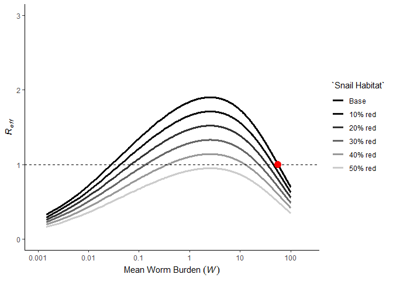

Model Animations
================
Chris Hoover
July 3, 2019

Effects of MDA on *R*<sub>*e**f**f*</sub>
=========================================

Basic schistosomiasis model simulation with MDA administered to treated segment of the population and untreated segment of the population left alone
----------------------------------------------------------------------------------------------------------------------------------------------------

``` r
#Base time and starting values for state variables
base_start <- c(S=5000, E=0, I=0, Wt=10, Wu=10)
years <- 30
base_time <- c(1:(365*years))

#Run to equibrium with base parameter set
base_eqbm <- runsteady(y = base_start, func = DDNTD::schisto_base_mod,
                       parms = DDNTD::base_pars)[["y"]]

#simulate annual MDA 
eff = 0.93 #93% efficacy
base_pars["cvrg"] <- 0.5 # 50 percent coverage

mda.events = data.frame(var = rep('Wt', years/2),
                        time = c(1:(years/2))*365,
                        value = rep((1 - eff), years/2),
                        method = rep('mult', years/2))

schisto_base_sim <- sim_schisto_mod(nstart = base_eqbm, 
                                    time = base_time, 
                                    model = schisto_base_mod,
                                    parameters = base_pars,
                                    events_df = mda.events) %>% 
  mutate(W = Wt*base_pars["cvrg"] + Wu*(1-base_pars["cvrg"]),
         kap = map_dbl(W, k_from_log_W),
         kap_Wt = map_dbl(Wt, k_from_log_W),
         kap_Wu = map_dbl(Wu, k_from_log_W),
         Reff = pmap_dbl(list(parameters = list(base_pars),
                              W = W,
                              kap = kap), getReff),
         Reff_Wt = pmap_dbl(list(parameters = list(base_pars),
                              W = Wt,
                              kap = kap_Wt), getReff),
         Reff_Wu = pmap_dbl(list(parameters = list(base_pars),
                              W = Wu,
                              kap = kap_Wu), getReff),
         Reff2 = Reff_Wt * base_pars["cvrg"] + Reff_Wu * (1-base_pars["cvrg"]),
         Coverage = base_pars["cvrg"])
```

    ## Warning in if (is.na(events_df)) {: the condition has length > 1 and only
    ## the first element will be used

``` r
schisto_base_plot <- schisto_base_sim %>% 
  gather("Treatment_Group", "Worm_Burden", Wt:W) %>% 
    ggplot(aes(x = time, y = Worm_Burden, lty = Treatment_Group)) +
    annotate("rect", xmin = 365, xmax = max(mda.events$time), ymin = -Inf, ymax = Inf,
             alpha = .2) +
      geom_line(size = 1.2, col = "purple") +
      scale_linetype_manual(values = c("W" = 1,
                                       "Wt" = 2,
                                       "Wu" = 3),
                            labels = c("Mean", "Treated", "Untreated")) +
      scale_x_continuous(breaks = c(0:years)*365,
                         labels = c(-1:(years-1))) +
      theme_classic() +
      ggtitle("Human infection dynamics", 
              subtitle = paste0("Anual MDA for ", years/2, " years at ", base_pars["cvrg"]*100, " % coverage"))

schisto_base_plot
```


### Look at influence of increasing MDA coverage on dynamics

``` r
base_pars -> base_pars_cvrg99 ; base_pars_cvrg99["cvrg"] = .99
base_pars -> base_pars_cvrg90 ; base_pars_cvrg90["cvrg"] = .90
base_pars -> base_pars_cvrg80 ; base_pars_cvrg80["cvrg"] = .80
base_pars -> base_pars_cvrg70 ; base_pars_cvrg70["cvrg"] = .70
base_pars -> base_pars_cvrg60 ; base_pars_cvrg60["cvrg"] = .60

schisto_cvrg_fx <- function(pars){
  schisto_sim <- sim_schisto_mod(nstart = base_eqbm, 
                                      time = base_time, 
                                      model = schisto_base_mod,
                                      parameters = pars,
                                      events_df = mda.events) %>% 
  mutate(W = Wt*pars["cvrg"] + Wu*(1-pars["cvrg"]),
         kap = map_dbl(W, k_from_log_W),
         kap_Wt = map_dbl(Wt, k_from_log_W),
         kap_Wu = map_dbl(Wu, k_from_log_W),
         Reff = pmap_dbl(list(parameters = list(pars),
                              W = W,
                              kap = kap), getReff),
         Reff_Wt = pmap_dbl(list(parameters = list(pars),
                              W = Wt,
                              kap = kap_Wt), getReff),
         Reff_Wu = pmap_dbl(list(parameters = list(pars),
                              W = Wu,
                              kap = kap_Wu), getReff),
         Reff2 = Reff_Wt * pars["cvrg"] + Reff_Wu * (1-pars["cvrg"]),
         Coverage = pars["cvrg"])
  
  return(schisto_sim)
}

schisto_cvrg60_sim <- schisto_cvrg_fx(base_pars_cvrg60)
```

    ## Warning in if (is.na(events_df)) {: the condition has length > 1 and only
    ## the first element will be used

``` r
schisto_cvrg70_sim <- schisto_cvrg_fx(base_pars_cvrg70)
```

    ## Warning in if (is.na(events_df)) {: the condition has length > 1 and only
    ## the first element will be used

``` r
schisto_cvrg80_sim <- schisto_cvrg_fx(base_pars_cvrg80)
```

    ## Warning in if (is.na(events_df)) {: the condition has length > 1 and only
    ## the first element will be used

``` r
schisto_cvrg90_sim <- schisto_cvrg_fx(base_pars_cvrg90)
```

    ## Warning in if (is.na(events_df)) {: the condition has length > 1 and only
    ## the first element will be used

``` r
schisto_cvrg99_sim <- schisto_cvrg_fx(base_pars_cvrg99)
```

    ## Warning in if (is.na(events_df)) {: the condition has length > 1 and only
    ## the first element will be used

``` r
schisto_cvrgs_df <- rbind(schisto_base_sim,
                          schisto_cvrg60_sim, 
                          schisto_cvrg70_sim,
                          schisto_cvrg80_sim,
                          schisto_cvrg90_sim,
                          schisto_cvrg99_sim)

schisto_cvrgs_plot <- schisto_cvrgs_df %>% 
  ggplot(aes(x = time, y = W, col = as.factor(Coverage))) +
    annotate("rect", xmin = 365, xmax = max(mda.events$time), ymin = -Inf, ymax = Inf,
             alpha = .2) +
      geom_line(size = 1.2) +
      scale_x_continuous(breaks = c(0:years)*365,
                         labels = c(-1:(years-1))) +
      theme_classic() +
      labs(title = "Human infection dynamics", 
           subtitle = paste0("Anual MDA for ", years/2, " years at variable coverage"),
           x = "Time (years)",
           color = "Coverage")

schisto_cvrgs_plot
```


Animate worm burden simulations through time at different coverages
-------------------------------------------------------------------

``` r
w_anim <- schisto_cvrgs_plot +
  transition_reveal(time)

w_anim
```


Baseline *R*<sub>*e**f**f*</sub> curve with base parameter set
--------------------------------------------------------------

``` r
test_ws <- seq(1e-2, sqrt(100), 
               by = sqrt(100*2)/1000)^2

#Get values of mean worm burden to plot R effective curve over
Reffs <- data.frame(test_ws = test_ws) %>% 
  mutate(w_det_ks = sapply(test_ws, k_from_log_W),
         Reff = pmap_dbl(list(parameters = list(base_pars),
                              W = test_ws,
                              kap = w_det_ks), getReff))

base_reff <- Reffs %>% 
  ggplot(aes(x = test_ws, y = Reff)) +
  geom_line(size = 1.2) +
  theme_classic() +
  scale_x_continuous(trans = "log",
                     breaks = c(0.001, 0.01, 0.1, 1, 10, 100),
                     labels = c("0.001", "0.01", "0.1", "1", "10", "100"),
                     limits = c(0.001, 200)) +
  scale_y_continuous(breaks = c(0:3),
                     limits = c(0,3)) +
  geom_hline(yintercept = 1, lty = 2) +
  labs(x = expression(Mean~Worm~Burden~(italic(W))),
       y = expression(italic(R[eff]))) 

base_reff
```

    ## Warning: Removed 2 rows containing missing values (geom_path).


Map *R*<sub>*e**f**f*</sub> estimates from model simulations through time onto *R*<sub>*e**f**f*</sub> curve to observe changes through time as MDA pushes population towards the breakpoint
--------------------------------------------------------------------------------------------------------------------------------------------------------------------------------------------

``` r
reff_anim <- base_reff +
  geom_point(data = schisto_cvrgs_df, aes(x = W, y = Reff, col = as.factor(Coverage)),
             size = 4) +
  theme(legend.position = "none") +
  transition_time(time)

reff_anim
```


### Combine two animations in single image

``` r
w_gif <- image_read(animate(w_anim, width = 720, height = 360))
reff_gif <- image_read(animate(reff_anim, width = 720, height = 360))

comb_gif <- image_append(c(w_gif[1], reff_gif[1]), stack = TRUE)

for(i in 2:100){
  combined <- image_append(c(w_gif[i], reff_gif[i]), stack = TRUE)
  comb_gif <- c(comb_gif, combined)
}

comb_gif
```


Stochastic schisto model
------------------------

``` r
set.seed(10)
sim_schisto_stoch <- function(sim){
  sim_schisto_stoch_mod(nstart = round(base_eqbm),
                                           params = as.list(base_pars_cvrg80),
                                           tf = max(base_time),
                                           events_df = mda.events) %>% 
  mutate(W = Wt*base_pars_cvrg80["cvrg"] + Wu*(1-base_pars_cvrg80["cvrg"]),
         kap = map_dbl(W, k_from_log_W),
         Reff = pmap_dbl(list(parameters = list(base_pars_cvrg80),
                              W = W,
                              kap = kap), getReff),
         sim = sim)
}

schisto_stoch_sims <- bind_rows(map_df(c(1:10), sim_schisto_stoch)) %>% 
  mutate(W = if_else(is.nan(Reff), 0.005, W),
         Reff = if_else(is.nan(Reff), 
                        getReff(base_pars_cvrg80, 0.005, k_from_log_W(0.005)), 
                        Reff))

schisto_stoch_sims_plot <- schisto_stoch_sims %>% 
  ggplot(aes(x = time, y = W, col = as.factor(sim))) +
    annotate("rect", xmin = 365, xmax = max(mda.events$time), ymin = -Inf, ymax = Inf,
             alpha = .2) +
    geom_line(size = 1.1) +
    scale_x_continuous(breaks = c(0:years)*365,
                       labels = c(-1:(years-1))) +
    theme_classic() +
    theme(legend.position = "none") +
    labs(x = "time (years)",
         y = expression(mean~worm~burden~(italic(W))),
         title = "Human infection dynamics from stochastic model", 
         subtitle = paste0("Anual MDA for ", years/2, " years at ", base_pars_cvrg80["cvrg"]*100, " % coverage"))

schisto_stoch_sims_plot +
  transition_reveal(time)
```


``` r
base_reff +
  geom_point(data = schisto_stoch_sims, aes(x = W, y = Reff, col = as.factor(sim)),
             size = 4) +
  theme(legend.position = "none") +
  transition_time(time) +
  labs(title = "Effective reproduction number year {round(frame_time/365,2)}")
```


Effects of snail habitat reduction on *R*<sub>*e**f**f*</sub>
=============================================================

Now look into interventions other than MDA that "push the curve down" rather than acting on the state variable *W*
------------------------------------------------------------------------------------------------------------------

### Example: Amount of snail habitat (modeled as snail environmental carrying capacity)

``` r
base_pars -> base_pars_C.90 ; base_pars_C.90["C"] = base_pars["C"]*.90
base_pars -> base_pars_C.80 ; base_pars_C.80["C"] = base_pars["C"]*.80
base_pars -> base_pars_C.70 ; base_pars_C.70["C"] = base_pars["C"]*.70
base_pars -> base_pars_C.60 ; base_pars_C.60["C"] = base_pars["C"]*.60
base_pars -> base_pars_C.50 ; base_pars_C.50["C"] = base_pars["C"]*.50

Reffs_C_red <- Reffs %>% 
  mutate(Reff_C.90 = pmap_dbl(list(parameters = list(base_pars_C.90),
                                   W = test_ws,
                                   kap = w_det_ks), getReff),
         Reff_C.80 = pmap_dbl(list(parameters = list(base_pars_C.80),
                                   W = test_ws,
                                   kap = w_det_ks), getReff),
         Reff_C.70 = pmap_dbl(list(parameters = list(base_pars_C.70),
                                   W = test_ws,
                                   kap = w_det_ks), getReff),
         Reff_C.60 = pmap_dbl(list(parameters = list(base_pars_C.60),
                                   W = test_ws,
                                   kap = w_det_ks), getReff),
         Reff_C.50 = pmap_dbl(list(parameters = list(base_pars_C.50),
                                   W = test_ws,
                                   kap = w_det_ks), getReff))

Reffs_C_red_plot <- Reffs_C_red %>% 
  gather("Snail Habitat", "Reff", Reff:Reff_C.50) %>% 
  ggplot(aes(x = test_ws, y = Reff, col = `Snail Habitat`)) +
    geom_line(size = 1.2) +
    theme_classic() +
    scale_x_continuous(trans = "log",
                       breaks = c(0.001, 0.01, 0.1, 1, 10, 100),
                       labels = c("0.001", "0.01", "0.1", "1", "10", "100"),
                       limits = c(0.001, 200)) +
    scale_y_continuous(breaks = c(0:3),
                       limits = c(0,3)) +
    geom_hline(yintercept = 1, lty = 2) +
    scale_color_manual(breaks = c("Reff", "Reff_C.90", "Reff_C.80", "Reff_C.70", "Reff_C.60", "Reff_C.50"),
                       labels = c("Base",
                                  "10% red",
                                  "20% red",
                                  "30% red",
                                  "40% red",
                                  "50% red"),
                       values = c("black", "grey80", "grey60", "grey40", "grey20", "grey5")) +
    labs(x = expression(Mean~Worm~Burden~(italic(W))),
         y = expression(italic(R[eff]))) 

Reffs_C_red_plot
```

    ## Warning: Removed 12 rows containing missing values (geom_path).


### What if we have an annual intervention that affects the snail habitat like vegetation removal?

``` r
#Generate forcing function that changes carrying capacity parameter over time
C_force_fx <- gen_force_fx(burn_in = 365, 
                           t_int = max(mda.events$time),
                           t_max = max(base_time), 
                           freq = 365, 
                           base_pars, "C", 0.75)

#Generate copies of base parameter set in dataframe and replace with C that changes through time
C_force_pars <- as.data.frame(as.list(base_pars)) %>% slice(rep(1:n(), each = max(base_time))) %>% 
  mutate(C = map_dbl(c(1:max(base_time)), C_force_fx))


#New schisto model object with C forcing function
schisto_base_mod_C_force_fx <- function(t, n, parameters) {

  f_N <- parameters["f_N"]
  C <- C_force_fx(t)
  mu_N <- parameters["mu_N"]
  sigma <- parameters["sigma"]
  mu_I <- parameters["mu_I"]
  mu_W <- parameters["mu_W"]
  H <- parameters["H"]
  mu_H <- parameters["mu_H"]
  lambda <- parameters["lambda"]
  beta <- parameters["beta"]
  cvrg <- parameters["cvrg"]
  gamma <- parameters["gamma"]
  xi <- parameters["xi"]

    S=n[1]
    E=n[2]
    I=n[3]
    Wt=n[4]
    Wu=n[5]

    N=S+E+I

    W=(cvrg*Wt) + ((1-cvrg)*Wu) #weighting treated and untreated populations

  #Clumping parameters based on worm burden
    k_Wt = k_from_log_W(Wt)
    k_Wu = k_from_log_W(Wu)

  #Miracidial estimate from treated and untreated populations assuming 1:1 sex ratio, mating probability, density dependence
    M = (0.5*Wt*H*cvrg)*phi_Wk(Wt, k_Wt)*f_Wgk(Wt, gamma, k_Wt) +
        (0.5*Wu*H*(1-cvrg))*phi_Wk(Wu, k_Wu)*f_Wgk(Wu, gamma, k_Wu)

    dSdt= f_N*(1-(N/C))*(S+E) - mu_N*S - beta*M*S #Susceptible snails

    dEdt= beta*M*S - (mu_N+sigma)*E #Exposed snails

    dIdt= sigma*E - (mu_N+mu_I)*I #Infected snails

    #worm burden in human
    dWtdt= (lambda*I*R_Wv(Wt, xi)) - ((mu_W+mu_H)*Wt)
    dWudt= (lambda*I*R_Wv(Wu, xi)) - ((mu_W+mu_H)*Wu)

    return(list(c(dSdt,dEdt,dIdt,dWtdt,dWudt)))
}

schisto_C_force_sim <- sim_schisto_mod(nstart = base_eqbm, 
                                       time = base_time, 
                                       model = schisto_base_mod_C_force_fx,
                                       parameters = base_pars,
                                       events_df = NA) %>% 
  mutate(W = Wt*base_pars["cvrg"] + Wu*(1-base_pars["cvrg"]),
         kap = map_dbl(W, k_from_log_W))

schisto_C_force_sim_Reffs <- numeric()

for(i in 1:max(base_time)){
  schisto_C_force_sim_Reffs[i] <- getReff(as.list(C_force_pars[i,]), schisto_C_force_sim$W[i], schisto_C_force_sim$kap[i])
}

schisto_C_force_sim <- schisto_C_force_sim %>% 
  mutate(Reff = schisto_C_force_sim_Reffs)

schisto_C_force_sim_plot <- schisto_C_force_sim %>% 
    ggplot(aes(x = time, y = W)) +
    annotate("rect", xmin = 365, xmax = max(mda.events$time), ymin = -Inf, ymax = Inf,
             alpha = .2) +
      geom_line(size = 1.2, col = "purple") +
      scale_linetype_manual(values = c("W" = 1,
                                       "Wt" = 2,
                                       "Wu" = 3),
                            labels = c("Mean", "Treated", "Untreated")) +
      scale_x_continuous(breaks = c(0:years)*365,
                         labels = c(-1:(years-1))) +
      scale_y_continuous(limits = c(0, base_eqbm["Wt"]+1)) +
      theme_classic() +
      ggtitle("Human infection dynamics", 
              subtitle = paste0("Annual reduction in snail habitat e.g. due to vegetation removal"))

schisto_C_force_sim_plot
```


### Animate worm burden simulations through time with snail habitat reduction intervention

``` r
schisto_C_force_anim <- schisto_C_force_sim_plot +
  transition_reveal(time)

schisto_C_force_anim
```


### Animate *R*<sub>*e**f**f*</sub> over the course of the snail habitat intervention

``` r
reff_anim_C_force <- Reffs_C_red_plot +
  geom_point(data = schisto_C_force_sim, aes(x = W, y = Reff),
             size = 4, col = "red") +
  transition_time(time)

reff_anim_C_force
```



### Combine two animations in single image

``` r
schisto_C_force_gif <- image_read(animate(schisto_C_force_anim, width = 720, height = 360))
reff_C_force_gif <- image_read(animate(reff_anim_C_force, width = 720, height = 360))

comb_C_force_gif <- image_append(c(schisto_C_force_gif[1], reff_C_force_gif[1]), stack = TRUE)

for(i in 2:100){
  combined <- image_append(c(schisto_C_force_gif[i], reff_C_force_gif[i]), stack = TRUE)
  comb_C_force_gif <- c(comb_C_force_gif, combined)
}

comb_C_force_gif
```


Effects of combined interventions on *R*<sub>*e**f**f*</sub>
============================================================

MDA + Snail habitat control
---------------------------

``` r
schisto_cvrg_C_red_fx <- function(pars){
  schisto_sim <- sim_schisto_mod(nstart = base_eqbm, 
                                      time = base_time, 
                                      model = schisto_base_mod_C_force_fx,
                                      parameters = pars,
                                      events_df = mda.events) %>% 
  mutate(W = Wt*pars["cvrg"] + Wu*(1-pars["cvrg"]),
         kap = map_dbl(W, k_from_log_W))
  
  schisto_sim_Reffs <- numeric()

for(i in 1:max(base_time)){
  schisto_sim_Reffs[i] <- getReff(as.list(C_force_pars[i,]), schisto_sim$W[i], schisto_sim$kap[i])
}

schisto_sim <- schisto_sim %>% 
  mutate(Reff = schisto_sim_Reffs,
         Coverage = pars["cvrg"])

  return(schisto_sim)
}

schisto_cvrg60_C_red_sim <- schisto_cvrg_C_red_fx(base_pars_cvrg60)
```

    ## Warning in if (is.na(events_df)) {: the condition has length > 1 and only
    ## the first element will be used

``` r
schisto_cvrg70_C_red_sim <- schisto_cvrg_C_red_fx(base_pars_cvrg70)
```

    ## Warning in if (is.na(events_df)) {: the condition has length > 1 and only
    ## the first element will be used

``` r
schisto_cvrg80_C_red_sim <- schisto_cvrg_C_red_fx(base_pars_cvrg80)
```

    ## Warning in if (is.na(events_df)) {: the condition has length > 1 and only
    ## the first element will be used

``` r
schisto_cvrg90_C_red_sim <- schisto_cvrg_C_red_fx(base_pars_cvrg90)
```

    ## Warning in if (is.na(events_df)) {: the condition has length > 1 and only
    ## the first element will be used

``` r
schisto_cvrg99_C_red_sim <- schisto_cvrg_C_red_fx(base_pars_cvrg99)
```

    ## Warning in if (is.na(events_df)) {: the condition has length > 1 and only
    ## the first element will be used

``` r
schisto_cvrgs_C_red_df <- rbind(schisto_C_force_sim %>% mutate(Coverage = 0),
                                schisto_cvrg60_C_red_sim, 
                                schisto_cvrg70_C_red_sim,
                                schisto_cvrg80_C_red_sim,
                                schisto_cvrg90_C_red_sim,
                                schisto_cvrg99_C_red_sim)

schisto_cvrgs_C_red_plot <- schisto_cvrgs_C_red_df %>% 
  ggplot(aes(x = time, y = W, col = as.factor(Coverage))) +
    annotate("rect", xmin = 365, xmax = max(mda.events$time), ymin = -Inf, ymax = Inf,
             alpha = .2) +
      geom_line(size = 1.2) +
      scale_x_continuous(breaks = c(0:years)*365,
                         labels = c(-1:(years-1))) +
      theme_classic() +
      labs(title = "Human infection dynamics", 
           subtitle = paste0("Anual MDA for ", years/2, " years at variable coverage AND annual snail habitat reduction"),
           x = "Time (years)",
           color = "Coverage")

schisto_cvrgs_C_red_plot
```


``` r
reff_MDA_C_red_anim <- base_reff +
  geom_point(data = schisto_cvrgs_C_red_df, aes(x = W, y = Reff, col = as.factor(Coverage)),
             size = 4) +
  theme(legend.position = "none") +
  transition_time(time)

reff_MDA_C_red_anim
```


