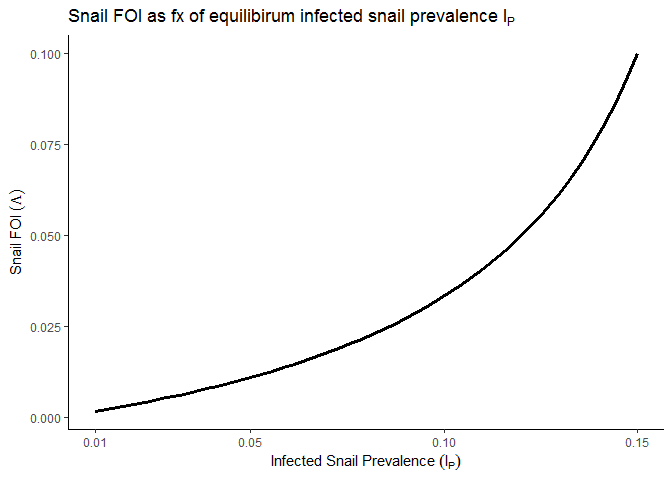
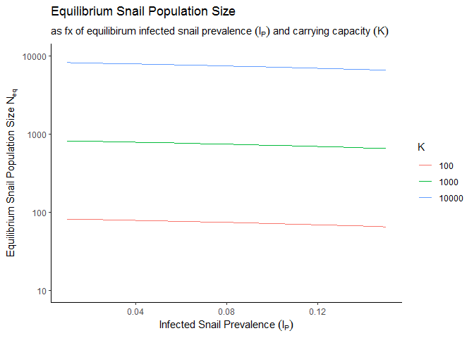
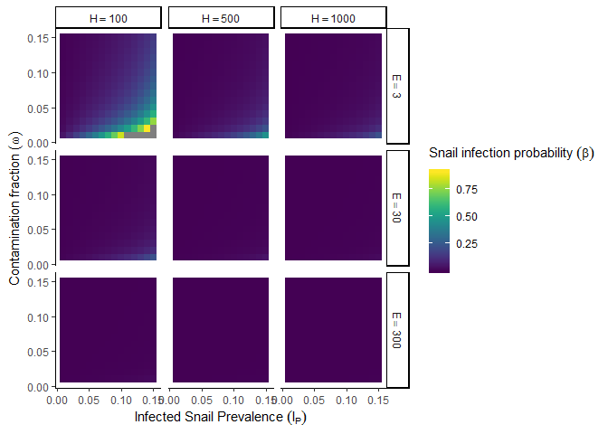
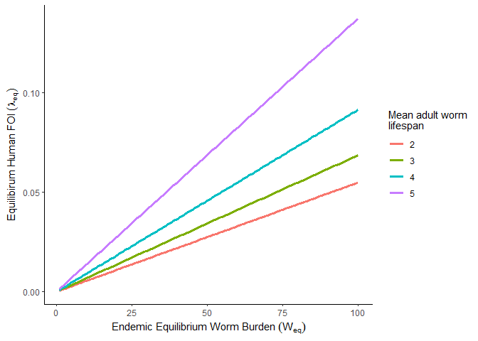

Main parameters, outcomes, and determinants
================

Inputs
======

Observational data
------------------

-   Egg burden data on an individual or aggregated community/school level → infection intensity (*W*)
-   Prevalence of individuals with sign of infection → prevalence of mated (egg producing) female worms (*Ω*)
-   Human population size, *H*
-   Infected snail prevalence (*I*<sub>*P*</sub>)
-   Snail environmental carrying capacity (*K*)

Known model parameters
----------------------

-   Snail mean lifespan, *μ*<sub>*N*</sub> = 1/60 days
-   Infected snail mean lifespan, *μ*<sub>*I*</sub> = 1/10 days
-   Patency conversion rate from exposed to infected, *σ* = 1/40 days
-   Maximum reproduction rate, *r* = 0.1

-   Mean urine produced per day per individual (in units of 10mL), *U* = 100
-   Egg viability (miracidia hatched from eggs produced), *v* = 0.08

Estimates from equilibrium inputs
=================================

Snail FOI from infected snail prevalence
----------------------------------------

%7D%7B%5Cfrac%7B%5Csigma%7D%7BI_P%7D-%5Cmu_I-%5Csigma%7D)

``` r
snail_dat <- data.frame(I_P = seq(0.01,0.15, length.out = 50),
                        Lambda = sapply(seq(0.01,0.15, length.out = 50), I_get_Lambda,
                                        mu_N = base_pars["mu_N"],
                                        mu_I = base_pars["mu_I"],
                                        sigma = base_pars["sigma"]))

snail_dat %>% 
  ggplot(aes(x = I_P, y = Lambda)) +
    geom_line(size = 1.2) +
    theme_classic() +
    scale_x_continuous(breaks = c(0.01, 0.05, 0.1, 0.15)) +
    labs(x = expression(Infected~Snail~Prevalence~(I[P])),
         y = expression(Snail~FOI~(Lambda)),
         title = expression(Snail~FOI~as~fx~of~equilibirum~infected~snail~prevalence~I[P]))
```



Equilibrium snail population size from infected snail prevalence (via estimation of *Λ*) and snail environmental carrying capacity
----------------------------------------------------------------------------------------------------------------------------------

%3DK%5CBig(1-%5Cfrac%7B%5Cmu_N+%5CLambda%7D%7Br%5Cbig(1+%5Cfrac%7B%5CLambda%7D%7B%5Cmu_N+%5Csigma%7D%5Cbig)%7D%5CBig))

``` r
snail_dat2 <- as.data.frame(expand.grid(I_P = seq(0.01,0.15, length.out = 50),
                                        K = c(100, 1000, 10000))) %>% 
  mutate(Lambda = map_dbl(I_P, I_get_Lambda,
                          mu_N = base_pars["mu_N"],
                          mu_I = base_pars["mu_I"],
                          sigma = base_pars["sigma"]),
         N_eq = map2_dbl(Lambda, K, Lambda_get_N_eq,
                         mu_N = base_pars["mu_N"],
                         r = base_pars["r"],
                         sigma = base_pars["sigma"]))

snail_dat2 %>% 
  ggplot(aes(x = I_P, y = N_eq, col = as.factor(K))) +
    geom_line() +
    scale_y_continuous(trans = "log",
                       breaks = c(10,100,1000,10000),
                       limits = c(10, 10000)) +
    theme_classic() +
    labs(x = expression(Infected~Snail~Prevalence~(I[P])),
         y = expression(Equilibrium~Snail~Population~Size~N[eq]),
         col = "K",
         title = expression(Equilibrium~Snail~Population~Size),
         subtitle = expression(as~fx~of~equilibirum~infected~snail~prevalence~(I[P])~and~carrying~capacity~(K)))
```



Per contact probability of snail infection as function of infected snail prevalence (and resulting *Λ*), mean egg output, human population size, and exposure/contamination parameter (*ω*)
-------------------------------------------------------------------------------------------------------------------------------------------------------------------------------------------

*Λ* and *N*<sup>\*</sup>(*Λ*) derived from *I*<sub>*P*</sub> and *K*, ℰ and *H* are observational, *U* and *v* are assumed known, and *ω* is the main unknown

%7D%7B%5Cmathcal%7BE%7DHUv%5Comega%7D%3D%5CLambda%20K%5CBig(1-%5Cfrac%7B%5Cmu_N+%5CLambda%7D%7Br%5Cbig(1+%5Cfrac%7B%5CLambda%7D%7B%5Cmu_N+%5Csigma%7D%5Cbig)%7D%5CBig))

``` r
beta_dat <- as.data.frame(expand.grid(I_P = seq(0.01,0.15, length.out = 15),
                                      omega = seq(0.01,0.15, length.out = 15),
                                      egg_output = c(3,30,300),
                                      H = c(100, 500, 1000))) %>% 
  mutate(Lambda = map_dbl(I_P, I_get_Lambda,
                          mu_N = base_pars["mu_N"],
                          mu_I = base_pars["mu_I"],
                          sigma = base_pars["sigma"]),
         N_eq = map_dbl(Lambda,Lambda_get_N_eq,
                        K = 1000,
                        mu_N = base_pars["mu_N"],
                        r = base_pars["r"],
                        sigma = base_pars["sigma"]))

beta_dat$beta <- apply(beta_dat, 1, function(x){
  beta_from_eggs(egg_output = x["egg_output"],
                 H = x["H"],
                 Lambda = x["Lambda"],
                 N_eq = x["N_eq"],
                 U = base_pars["U"],
                 v = base_pars["v"],
                 omega = x["omega"])
})

beta_dat %>% 
  mutate(beta = if_else(beta>1, NA_real_, beta)) %>% 
  ggplot(aes(x = I_P, y = omega)) +
    geom_tile(aes(fill = beta)) +
    theme_classic() +
    facet_grid(egg_output~H, labeller = label_bquote("E"==.(egg_output), "H"==.(H))) +
    scale_fill_viridis() +
    labs(x = expression(Infected~Snail~Prevalence~(I[P])),
         y = expression(Contamination~fraction~(omega)),
         fill = expression(Snail~infection~probability~(beta)))
```



Worm acquisition rate or human FOI as function of adult worm mean lifespan and equilibirum infection intensity
--------------------------------------------------------------------------------------------------------------


``` r
W_dat <- expand.grid(mu_W = c(1/(2*365), 1/(3*365), 1/(4*365), 1/(5*365)),
                     W_star = c(1:100)) %>% 
  mutate(lambda_star = mu_W*W_star)

W_dat %>% 
  ggplot(aes(x = W_star, y = lambda_star, col = as.factor(mu_W))) +
    geom_line(size = 1.2) +
    theme_classic() +
    scale_color_discrete(name = "Mean adult worm\nlifespan",
                         labels = c(2:5)) +
    labs(x = expression(Endemic~Equilibrium~Worm~Burden~(W[eq])),
         y = expression(Equilibirum~Human~FOI~(lambda[eq])))
```


