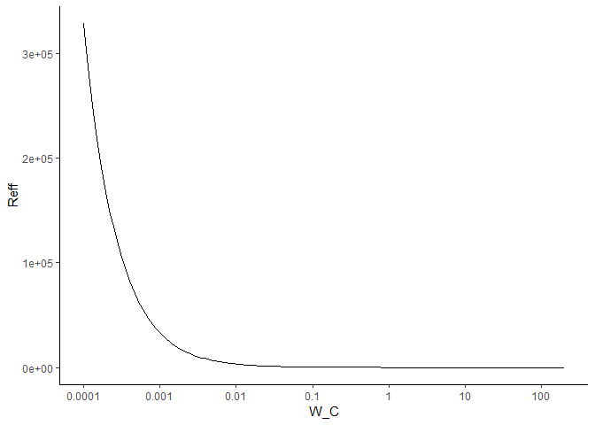

*R*<sub>*e**f**f*</sub> Simulations with age-structured model
================

*R*<sub>*e**f**f*</sub> curve in high prevalence setting
--------------------------------------------------------

``` r
# Egg burdens and prevalence from V1, tbales 6 and 7 https://doi.org/10.1186/s13071-016-1681-4 
C_est_V1 <- convert_burden_egg_to_worm(60, 0.1, egg_burden = 126, prevalence = 0.71, age_strat_pars["m"], age_strat_pars["zeta"])
A_est_V1 <- convert_burden_egg_to_worm(10, 0.1, egg_burden = 19, prevalence = 0.33, age_strat_pars["m"], age_strat_pars["zeta"])

V1_pars <- infection_inputs_get_pars(W_A = A_est_V1[1],
                                     kap_A = A_est_V1[2],
                                     H_A = 508,
                                     cvrg_A = 0,
                                     W_C = C_est_V1[1],
                                     kap_C = C_est_V1[2],
                                     H_C = 602,
                                     cvrg_C = 0,
                                     K_ratio = 1,
                                     I_P = 0.1,
                                     pars = age_strat_pars)

  Reff_Wij(V1_pars, C_est_V1[1], C_est_V1[1], A_est_V1[1], A_est_V1[1])
```

    ##      W_bar       Reff  Reff_W_TC  Reff_W_UC  Reff_W_TA  Reff_W_UA 
    ## 36.9499070  0.9903141  1.0000000  1.0000000  0.9788360  0.9788360

``` r
W_C_seq <- exp_seq(1e-4, 1e3, 200)
W_A_seq <- c(0.0001, 0.001, 0.01, 0.1, 1, A_est_V1[1])

W_bar_grid <- expand.grid(W_C = W_C_seq, W_A = W_A_seq) %>% 
  mutate(W_bar = W_C * V1_pars["h_c"] + W_A * V1_pars["h_a"],
         Reff = mapply(Reff_Wij, W_C, W_C, W_A, W_A, MoreArgs = list(pars = V1_pars))[2,])
  
W_bar_grid %>% 
  filter(W_A == A_est_V1[1]) %>% 
  ggplot(aes(x = W_C, y = Reff)) + 
    geom_line() +
    theme_classic() +
    scale_x_continuous(trans = "log",
                       breaks = c(1e-4, 1e-3, 1e-2, 0.1, 1, 10, 100),
                       labels = c("0.0001", "0.001", "0.01", "0.1", "1", "10", "100"),
                       limits = c(1e-4, 200))
```

    ## Warning: Removed 20 rows containing missing values (geom_path).



So that's weird. Let's dig into the Reff expression a bit more and try and figure out what's going on

``` r
W_TC <- C_est_V1[1]
W_UC <- C_est_V1[1]
W_TA <- A_est_V1[1]
W_UA <- A_est_V1[1]

pars <- V1_pars


# This is the Reff expression cop pasted from the R function

  # Get mean worm burden of total population as weighted sum of worm burden in each age/treatment group
  W_bar <- W_TC*pars["h_tc"]+
           W_UC*pars["h_uc"]+
           W_TA*pars["h_ta"]+
           W_UA*pars["h_ua"]

  ##standard snail parameters
    r=pars["r"]             # recruitment rate (from sokolow et al)
    K=pars["K"]          # carrying capacity corresponding to 50 snails per square meter
    mu_N=pars["mu_N"]          # Mean mortality rate of snails (assuming lifespan of 60days)
    sigma=pars["sigma"]         # Transition rate from exposed to infected (assuming pre-patency period of ~4 weeks) doi:10.4269/ajtmh.16-0614
    mu_I=pars["mu_I"]          # Increased mortality rate of infected snails
    theta=pars["theta"]          # mean cercarial shedding rate per adult snail doi:10.4269/ajtmh.16-0614

  #Adult Worm, Miracidia and Cercariae Parameters
    mu_W = pars["mu_W"]   # death rate of adult worms
    mu_H_A = pars["mu_H_A"] # death rate of adult humans
    mu_H_C = pars["mu_H_C"] # death rate of children
    m = pars["m"]             # mean eggs shed per female worm per 10mL urine (truscott et al)
    v = pars["v"]           # mean egg viability (miracidia per egg)

  #Density dependence parameters
    zeta = pars["zeta"]       # parameter of fecundity reduction function
    xi = pars["xi"]        # parameter for acquired immunity function http://doi.wiley.com/10.1111/j.1365-3024.1992.tb00029.x

  #Human parameters
    H = pars["H"]
    h_tc = pars["h_tc"]         # Total number of treated children
    h_uc = pars["h_uc"]          # Total number of untreated children
    h_ta = pars["h_ta"]           # Total number of treated adults
    h_ua = pars["h_ua"]         # Total number of untreated adults
    U_C = pars["U_C"]          # mL urine produced per child per day /10mL https://doi.org/10.1186/s13071-016-1681-4
    U_A = pars["U_A"]          # mL urine produced per adult per day /10mL https://doi.org/10.1186/s13071-016-1681-4
    omega_c = pars["omega_c"]          #  infection risk/contamination of SAC  (related to sanitation/education/water contact) 10.1186/s13071-016-1681-4
    omega_a = pars["omega_a"]          #  infection risk/contamination of adults (related to sanitation/education/water contact) 10.1186/s13071-016-1681-4
    Omega = pars["Omega"]          # relative infection risk/contamination of SAC vs adults

  #Transmission parameters
    alpha=pars["alpha"]       # Cercarial infection probability
    Lambda_0=pars["Lambda_0"]         # first parameter of non-linear man-to-snail FOI

  # Get miracidial density as function of worm burdens
    #Update clumping parameter, k from estimate of worm burden in each population
      k_TC = k_from_log_W(W_TC)
      k_UC = k_from_log_W(W_UC)
      k_TA = k_from_log_W(W_TA)
      k_UA = k_from_log_W(W_UA)

    #Estimate mating probability within each strata
      phi_W_TC = phi_Wk(W = W_TC, k = k_TC)  #Mating probability in treated SAC population
      phi_W_UC = phi_Wk(W = W_UC, k = k_UC)  #Mating probability in untreated SAC population
      phi_W_TA = phi_Wk(W = W_TA, k = k_TA)  #Mating probability in treated adult population
      phi_W_UA = phi_Wk(W = W_UA, k = k_UA)  #Mating probability in untreated adult population

    # Estimate total miracidia entering snail habitat
      M_tot = 0.5*H*omega_a*v*m*((W_TC*phi_W_TC) * rho_Wk(W_TC, zeta, k_TC) * U_C*h_tc*Omega +
                                   (W_UC*phi_W_UC) * rho_Wk(W_UC, zeta, k_UC) * U_C*h_uc*Omega +
                                   (W_TA*phi_W_TA) * rho_Wk(W_TA, zeta, k_TA) * U_A*h_ta +
                                   (W_UA*phi_W_UA) * rho_Wk(W_UA, zeta, k_UA) * U_A*h_ua)

  # Get man-to-snail FOI as solution given M_tot and other parameters
    Lambda <- uniroot(function(L) Lambda_0*(1-exp(-M_tot/(K*(1-(mu_N+L)/(r*(1+L/(mu_N+sigma)))))))-L, c(1e-8,10))$root

  #get Reff in each group
    Reff_W_TC <- as.numeric((alpha*omega_c*theta*K*sigma*(1-(mu_N+Lambda)/(r*(1+Lambda/(mu_N+sigma)))))/(((mu_I*(mu_N+sigma))/Lambda+mu_I+sigma)*(mu_W+mu_H_C)*W_TC))
    Reff_W_UC <- as.numeric((alpha*omega_c*theta*K*sigma*(1-(mu_N+Lambda)/(r*(1+Lambda/(mu_N+sigma)))))/(((mu_I*(mu_N+sigma))/Lambda+mu_I+sigma)*(mu_W+mu_H_C)*W_UC))
    Reff_W_TA <- as.numeric((alpha*omega_a*theta*K*sigma*(1-(mu_N+Lambda)/(r*(1+Lambda/(mu_N+sigma)))))/(((mu_I*(mu_N+sigma))/Lambda+mu_I+sigma)*(mu_W+mu_H_A)*W_TA))
    Reff_W_UA <- as.numeric((alpha*omega_a*theta*K*sigma*(1-(mu_N+Lambda)/(r*(1+Lambda/(mu_N+sigma)))))/(((mu_I*(mu_N+sigma))/Lambda+mu_I+sigma)*(mu_W+mu_H_A)*W_UA))

  # Net Reff
    Reff <- Reff_W_TC*pars["h_tc"]+
            Reff_W_UC*pars["h_uc"]+
            Reff_W_TA*pars["h_ta"]+
            Reff_W_UA*pars["h_ua"]
    
    Reff
```

    ##      h_tc 
    ## 0.9903141

So at equilibirum, Reff is essentially 1, that checks out. Let's decrease the worm burdens and see what happens

``` r
W_TC <- C_est_V1[1]*0.01
W_UC <- C_est_V1[1]*0.01
W_TA <- A_est_V1[1]
W_UA <- A_est_V1[1]

pars <- V1_pars

# This is the Reff expression cop pasted from the R function

  # Get mean worm burden of total population as weighted sum of worm burden in each age/treatment group
  W_bar <- W_TC*pars["h_tc"]+
           W_UC*pars["h_uc"]+
           W_TA*pars["h_ta"]+
           W_UA*pars["h_ua"]

  ##standard snail parameters
    r=pars["r"]             # recruitment rate (from sokolow et al)
    K=pars["K"]          # carrying capacity corresponding to 50 snails per square meter
    mu_N=pars["mu_N"]          # Mean mortality rate of snails (assuming lifespan of 60days)
    sigma=pars["sigma"]         # Transition rate from exposed to infected (assuming pre-patency period of ~4 weeks) doi:10.4269/ajtmh.16-0614
    mu_I=pars["mu_I"]          # Increased mortality rate of infected snails
    theta=pars["theta"]          # mean cercarial shedding rate per adult snail doi:10.4269/ajtmh.16-0614

  #Adult Worm, Miracidia and Cercariae Parameters
    mu_W = pars["mu_W"]   # death rate of adult worms
    mu_H_A = pars["mu_H_A"] # death rate of adult humans
    mu_H_C = pars["mu_H_C"] # death rate of children
    m = pars["m"]             # mean eggs shed per female worm per 10mL urine (truscott et al)
    v = pars["v"]           # mean egg viability (miracidia per egg)

  #Density dependence parameters
    zeta = pars["zeta"]       # parameter of fecundity reduction function
    xi = pars["xi"]        # parameter for acquired immunity function http://doi.wiley.com/10.1111/j.1365-3024.1992.tb00029.x

  #Human parameters
    H = pars["H"]
    h_tc = pars["h_tc"]         # Total number of treated children
    h_uc = pars["h_uc"]          # Total number of untreated children
    h_ta = pars["h_ta"]           # Total number of treated adults
    h_ua = pars["h_ua"]         # Total number of untreated adults
    U_C = pars["U_C"]          # mL urine produced per child per day /10mL https://doi.org/10.1186/s13071-016-1681-4
    U_A = pars["U_A"]          # mL urine produced per adult per day /10mL https://doi.org/10.1186/s13071-016-1681-4
    omega_c = pars["omega_c"]          #  infection risk/contamination of SAC  (related to sanitation/education/water contact) 10.1186/s13071-016-1681-4
    omega_a = pars["omega_a"]          #  infection risk/contamination of adults (related to sanitation/education/water contact) 10.1186/s13071-016-1681-4
    Omega = pars["Omega"]          # relative infection risk/contamination of SAC vs adults

  #Transmission parameters
    alpha=pars["alpha"]       # Cercarial infection probability
    Lambda_0=pars["Lambda_0"]         # first parameter of non-linear man-to-snail FOI

  # Get miracidial density as function of worm burdens
    #Update clumping parameter, k from estimate of worm burden in each population
      k_W_bar = k_from_log_W(W_bar)

    #Estimate mating probability within each strata
      phi_W_TC = phi_Wk(W = W_TC, k = k_TC)  #Mating probability in treated SAC population
      phi_W_UC = phi_Wk(W = W_UC, k = k_UC)  #Mating probability in untreated SAC population
      phi_W_TA = phi_Wk(W = W_TA, k = k_TA)  #Mating probability in treated adult population
      phi_W_UA = phi_Wk(W = W_UA, k = k_UA)  #Mating probability in untreated adult population

    # Estimate total miracidia entering snail habitat
      M_tot = 0.5*H*omega_a*v*m*((W_TC*phi_W_TC) * rho_Wk(W_TC, zeta, k_TC) * U_C*h_tc*Omega +
                                   (W_UC*phi_W_UC) * rho_Wk(W_UC, zeta, k_UC) * U_C*h_uc*Omega +
                                   (W_TA*phi_W_TA) * rho_Wk(W_TA, zeta, k_TA) * U_A*h_ta +
                                   (W_UA*phi_W_UA) * rho_Wk(W_UA, zeta, k_UA) * U_A*h_ua)

  # Get man-to-snail FOI as solution given M_tot and other parameters
    Lambda <- uniroot(function(L) Lambda_0*(1-exp(-M_tot/(K*(1-(mu_N+L)/(r*(1+L/(mu_N+sigma)))))))-L, c(1e-8,10))$root

  #get Reff in each group
    Reff_W_TC <- as.numeric((alpha*omega_c*theta*K*sigma*(1-(mu_N+Lambda)/(r*(1+Lambda/(mu_N+sigma)))))/(((mu_I*(mu_N+sigma))/Lambda+mu_I+sigma)*(mu_W+mu_H_C)*W_TC))
    Reff_W_UC <- as.numeric((alpha*omega_c*theta*K*sigma*(1-(mu_N+Lambda)/(r*(1+Lambda/(mu_N+sigma)))))/(((mu_I*(mu_N+sigma))/Lambda+mu_I+sigma)*(mu_W+mu_H_C)*W_UC))
    Reff_W_TA <- as.numeric((alpha*omega_a*theta*K*sigma*(1-(mu_N+Lambda)/(r*(1+Lambda/(mu_N+sigma)))))/(((mu_I*(mu_N+sigma))/Lambda+mu_I+sigma)*(mu_W+mu_H_A)*W_TA))
    Reff_W_UA <- as.numeric((alpha*omega_a*theta*K*sigma*(1-(mu_N+Lambda)/(r*(1+Lambda/(mu_N+sigma)))))/(((mu_I*(mu_N+sigma))/Lambda+mu_I+sigma)*(mu_W+mu_H_A)*W_UA))

  # Net Reff
    Reff <- Reff_W_TC*pars["h_tc"]+
            Reff_W_UC*pars["h_uc"]+
            Reff_W_TA*pars["h_ta"]+
            Reff_W_UA*pars["h_ua"]
    
    Reff
```

    ##     h_tc 
    ## 54.67262

So Reff begins to skyrocket for the population that is treated. Let's focus in particular on the denominator of the *R*<sub>*e**f**f*</sub> expression:

W%5CBig(%5Cfrac%7B%5Cmu_I(%5Cmu_N+%5Csigma)%7D%7B%5CLambda%7D+%5Cmu_I+%5Csigma%5CBig))

In particular we draw attention to *W* and *Λ* which is actually a function of *W*:

%3D%5CLambda_0(1-e%5E%7B-0.5H%5Comega%20vmW%5CPhi(W)%5Crho(W)U/N%7D))
