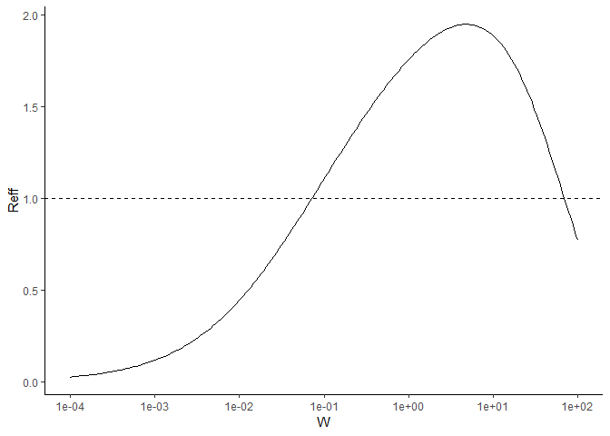
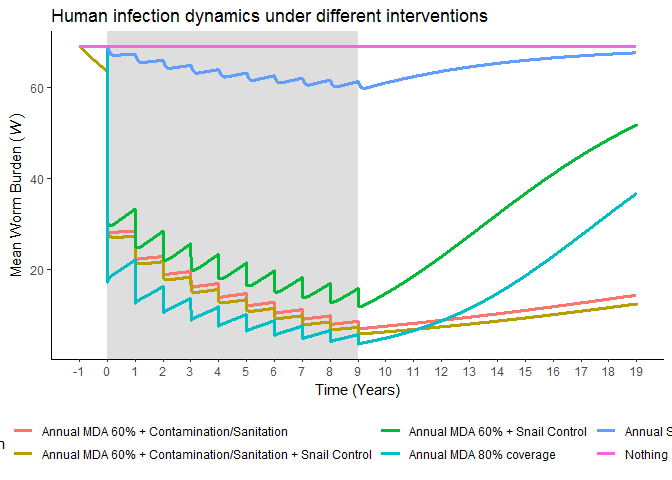

Schisto stochastic mode Probability of Elimination
================
Chris Hoover
July 11, 2019

``` r
W = 60
Lambda = 0.025
fit_pars <- base_pars
fit_pars["cvrg"] = 0

  M = 0.5*W*base_pars["H"]*phi_Wk(W, k_from_log_W(W))*rho_Wk(W, base_pars["zeta"], k_from_log_W(W))*base_pars["omega"]*base_pars["U"]*base_pars["m"]*base_pars["v"]  
  
  N_eq = Lambda_get_N_eq(Lambda, base_pars["K"], base_pars["mu_N"], base_pars["r"], base_pars["sigma"])
  I_eq = (base_pars["sigma"]*N_eq)/(base_pars["mu_I"]*(base_pars["mu_N"]+base_pars["sigma"])/Lambda+base_pars["mu_I"]+base_pars["sigma"])
  
  fit_pars["beta"] = Lambda*M/N_eq
  
  fit_pars["alpha"] = (W*(base_pars["mu_H"] + base_pars["mu_W"]))/(base_pars["omega"]*I_eq*base_pars["theta"])
  
base_start <- c(S=as.numeric(N_eq)*0.5, E=0, I=as.numeric(I_eq), Wt=W, Wu=W)
    
base_eqbm <- runsteady(y = base_start, func = schisto_base_mod,
                       parms = fit_pars)[["y"]]

Reff_W(base_eqbm["Wt"], fit_pars)
```

    ##       Reff        I_P     Lambda 
    ## 1.00000001 0.10313086 0.03548804

``` r
data.frame("W" = exp_seq(1e-4,100,200),
              "Reff" = sapply(X = exp_seq(1e-4,100,200), FUN = Reff_W, pars = fit_pars)[1,]) %>% 
  ggplot(aes(x = W, y = Reff)) +
    geom_line() +
    theme_classic() +
    geom_hline(yintercept = 1, lty = 2) +
    scale_x_continuous(trans = "log",
                       breaks = c(1e-4,1e-3,1e-2,0.1,1,10,100))
```



``` r
years <- 10
mda.eff <- 0.94
snail.eff <- 0.85

#Base time and starting values for state variables
base_time <- c(0:(365*(years*2)))

#Intervention parameter sets 
  # 80 % MDA coverage
    fit_pars -> pars_cvrg80 ; pars_cvrg80["cvrg"] = .80
  
  # 80% MDA coverage and 20% reduction in exposure/contamination
    pars_cvrg80 -> pars_cvrg80_om20 ; pars_cvrg80_om20["omega"] = fit_pars["omega"]*0.8

  # 60 % MDA coverage
    fit_pars -> pars_cvrg60 ; pars_cvrg60["cvrg"] = .60
  
  # 60% MDA coverage and 20% reduction in exposure contamination
    pars_cvrg60 -> pars_cvrg60_om20 ; pars_cvrg60_om20["omega"] = fit_pars["omega"]*0.8

#Events data frames    
mda.events <- data.frame(var = rep('Wt', years),
                         time = c(1:years)*365+1,
                         value = rep((1 - mda.eff), years),
                         method = rep('mult', years))

#Snail control dataframes
snail.annual.events <- data.frame(var = rep(c('S', 'E', 'I'), years),
                                  time = rep(c(1:years)*365+1, each = 3),
                                  value = rep((1 - snail.eff), years*3),
                                  method = rep('mult', years*3))

#MDA and snail control events together
mda.snail.events <- rbind(mda.events, snail.annual.events) %>% 
  arrange(time)

#Run to equibrium with base parameter set
base_eqbm <- runsteady(y = base_start, func = schisto_base_mod,
                       parms = pars_cvrg80)[["y"]]

#Run to equilibrium with om20_red parameter set
om20red_eqbm <- runsteady(y = base_start, func = schisto_base_mod,
                         parms = pars_cvrg80_om20)[["y"]]
```

``` r
#simulate annual MDA 
schisto_sims <- bind_rows(sim_schisto_mod(nstart = base_eqbm, 
                                          time = base_time, 
                                          model = schisto_base_mod,
                                          pars = pars_cvrg80,
                                          events_df = NA) %>% 
                            mutate(W = Wt*pars_cvrg80["cvrg"] + Wu*(1-pars_cvrg80["cvrg"]),
                                   Sim = "Nothing"),
                          sim_schisto_mod(nstart = base_eqbm, 
                                          time = base_time, 
                                          model = schisto_base_mod,
                                          pars = pars_cvrg80,
                                          events_df = mda.events) %>% 
                            mutate(W = Wt*pars_cvrg80["cvrg"] + Wu*(1-pars_cvrg80["cvrg"]),
                                   Sim = "Annual MDA 80% coverage"),
                          sim_schisto_mod(nstart = base_eqbm, 
                                          time = base_time, 
                                          model = schisto_base_mod,
                                          pars = pars_cvrg80,
                                          events_df = snail.annual.events) %>% 
                            mutate(W = Wt*pars_cvrg80["cvrg"] + Wu*(1-pars_cvrg80["cvrg"]),
                                   Sim = "Annual Snail Control"),
                          sim_schisto_mod(nstart = base_eqbm, 
                                          time = base_time, 
                                          model = schisto_base_mod,
                                          pars = pars_cvrg60,
                                          events_df = mda.snail.events) %>% 
                            mutate(W = Wt*pars_cvrg60["cvrg"] + Wu*(1-pars_cvrg60["cvrg"]),
                                   Sim = "Annual MDA 60% + Snail Control"),
                          sim_schisto_mod(nstart = base_eqbm, 
                                          time = base_time, 
                                          model = schisto_base_mod,
                                          pars = pars_cvrg60_om20,
                                          events_df = mda.events) %>% 
                            mutate(W = Wt*pars_cvrg60_om20["cvrg"] + Wu*(1-pars_cvrg60_om20["cvrg"]),
                                   Sim = "Annual MDA 60% + Contamination/Sanitation"),
                          sim_schisto_mod(nstart = base_eqbm, 
                                          time = base_time, 
                                          model = schisto_base_mod,
                                          pars = pars_cvrg60_om20,
                                          events_df = mda.snail.events) %>% 
                            mutate(W = Wt*pars_cvrg60_om20["cvrg"] + Wu*(1-pars_cvrg60_om20["cvrg"]),
                                   Sim = "Annual MDA 60% + Contamination/Sanitation + Snail Control"))

schisto_sims %>% 
    ggplot(aes(x = time, y = W, col = Sim)) +
    annotate("rect", xmin = 365, xmax = max(mda.events$time), ymin = -Inf, ymax = Inf,
             alpha = .2) +
      geom_line(size = 1.2) +
      scale_x_continuous(breaks = c(0:(years*2))*365,
                         labels = c(-1:(years*2-1))) +
      theme_classic() +
      theme(legend.position = "bottom") +
      labs(title = "Human infection dynamics under different interventions",
           x = "Time (Years)",
           y = expression(Mean~Worm~Burden~italic((W))))
```



``` r
test_stoch <- sim_schisto_stoch_mod(nstart= round(base_eqbm),
                      transitions = list(c(S = 1),             #New snail born
                                         c(S = -1),            #Susceptible snail dies
                                         c(S = -1, E = 1),     #Susceptible snail becomes exposed
                                         c(E = -1),            #Exposed snail dies
                                         c(E = -1, I = 1),     #Exposed snail becomes Infected
                                         c(I = -1),            #Infected snail dies
                                         c(Wt = 1),            #Infected snail emits cercaria that produces an adult worm in treated population
                                         c(Wu = 1),            #Infected snail emits cercaria that produces an adult worm in untreated population
                                         c(Wt = -1),           #Adult worm in the treated population dies
                                         c(Wu = -1)),           #Adult worm in the untreated population dies
                      sfx = schisto_stoch_mod,
                      params = pars_cvrg80,
                      tf = max(base_time),
                      events_df = mda.snail.events)

test_stoch %>% 
      mutate(W = pars_cvrg80["cvrg"]*Wt+(1-pars_cvrg80["cvrg"])*Wu) %>% 
      gather("Treatment", "Mean Worm Burden", Wt:W) %>% 
        ggplot(aes(x = time, y = `Mean Worm Burden`, col = Treatment)) +
        geom_line(size = 1.1) +
        theme_bw() +
        geom_vline(xintercept = unique(mda.snail.events$time), lty = 2, col = "red")
```


``` r
test_stoch %>% 
      mutate(N = S+E+I) %>% 
      gather("Infection Class", "Density", S:I,N) %>% 
        ggplot(aes(x = time, y = Density, col = `Infection Class`)) +
        geom_line(size = 1.1) +
        theme_bw() +
        geom_vline(xintercept = unique(mda.snail.events$time), lty = 2, col = "red")
```


``` r
set.seed(10)

schisto_stoch_sims <- bind_rows(lapply(c(1:10), sim_schisto_stoch, 
                                       pars = pars_cvrg80, events = mda.events))

schisto_stoch_sims %>% 
  group_by(sim) %>% 
  summarise(I_fin = I[which(time == max(time))],
            Wt_fin = Wt[which(time == max(time))],
            Wu_fin = Wu[which(time == max(time))],
            elim = if_else(I_fin + Wt_fin + Wu_fin == 0, 1, 0))
```

    ## # A tibble: 10 x 5
    ##      sim I_fin Wt_fin Wu_fin  elim
    ##    <int> <dbl>  <dbl>  <dbl> <dbl>
    ##  1     1   122     22     20     0
    ##  2     2   135     16     21     0
    ##  3     3   140     21     22     0
    ##  4     4    75     10      8     0
    ##  5     5   138     21     16     0
    ##  6     6    93     14     11     0
    ##  7     7   127     21     24     0
    ##  8     8    26      4      2     0
    ##  9     9   170     37     40     0
    ## 10    10   141     23     25     0

``` r
schisto_stoch_sims_plot <- schisto_stoch_sims %>% 
  ggplot(aes(x = time, y = W, col = as.factor(sim))) +
    annotate("rect", xmin = 365, xmax = max(mda.events$time), ymin = -Inf, ymax = Inf,
             alpha = .2) +
    geom_line(size = 1.1) +
    scale_x_continuous(breaks = c(0:(years*2))*365,
                       labels = c(-1:((years*2)-1))) +
    theme_classic() +
    theme(legend.position = "none") +
    labs(x = "time (years)",
         y = expression(mean~worm~burden~(italic(W))),
         title = "Human infection dynamics from stochastic model", 
         subtitle = paste0("Anual MDA for ", years/2, " years at ", pars_cvrg80["cvrg"]*100, "% coverage"))

schisto_stoch_sims_plot
```


``` r
n_sims <- 100
n_reps <- 100

#create cluster
library(parallel)
cl <- makeCluster(detectCores()-1)  
# get library support needed to run the code
clusterEvalQ(cl,library(DDNTD))
```

    ## [[1]]
    ##  [1] "DDNTD"       "dplyr"       "MDPtoolbox"  "linprog"     "lpSolve"    
    ##  [6] "Matrix"      "adaptivetau" "rootSolve"   "deSolve"     "stats"      
    ## [11] "graphics"    "grDevices"   "utils"       "datasets"    "methods"    
    ## [16] "base"       
    ## 
    ## [[2]]
    ##  [1] "DDNTD"       "dplyr"       "MDPtoolbox"  "linprog"     "lpSolve"    
    ##  [6] "Matrix"      "adaptivetau" "rootSolve"   "deSolve"     "stats"      
    ## [11] "graphics"    "grDevices"   "utils"       "datasets"    "methods"    
    ## [16] "base"       
    ## 
    ## [[3]]
    ##  [1] "DDNTD"       "dplyr"       "MDPtoolbox"  "linprog"     "lpSolve"    
    ##  [6] "Matrix"      "adaptivetau" "rootSolve"   "deSolve"     "stats"      
    ## [11] "graphics"    "grDevices"   "utils"       "datasets"    "methods"    
    ## [16] "base"

``` r
# put objects in place that might be needed for the code
clusterExport(cl,c("n_sims", "n_reps", "sim_schisto_stoch_elim_1_0", "sim_schisto_stoch_mod",
                   "mda.events", "mda.snail.events", "pars_cvrg60", "pars_cvrg60_om20",
                   "pars_cvrg80", "pars_cvrg80_om20", "base_eqbm", "base_time"))
# Set a different seed on each member of the cluster (just in case)
clusterSetRNGStream(cl)

#60% MDA coverage only #############
pe_mda60 <- replicate(n_reps, 
                      sum(parSapply(cl, 1:n_sims, 
                                    function(... ) sim_schisto_stoch_elim_1_0(pars_cvrg60, 
                                                                               base_eqbm, 
                                                                               mda.events))))

#60% MDA coverage and annual snail control ############
pe_mda60_snails <- replicate(n_reps, 
                      sum(parSapply(cl, 1:n_sims, 
                                    function(... ) sim_schisto_stoch_elim_1_0(pars_cvrg60, 
                                                                              base_eqbm, 
                                                                              mda.snail.events))))

#60% MDA coverage and 20% Contamination/Sanitation ############
  pe_mda60_Cred <- replicate(n_reps, 
                             sum(parSapply(cl, 1:n_sims, 
                                           function(... ) sim_schisto_stoch_elim_1_0(pars_cvrg60_om20, 
                                                                                     base_eqbm, 
                                                                                     mda.events))))

#60% MDA coverage and 20% Contamination/Sanitation and annual snail control ###########
  pe_mda60_snails_Cred <- replicate(n_reps, 
                                    sum(parSapply(cl, 1:n_sims, 
                                                  function(... ) sim_schisto_stoch_elim_1_0(pars_cvrg60_om20, 
                                                                                            base_eqbm, 
                                                                                            mda.snail.events))))

#stop the cluster
stopCluster(cl)
```

``` r
data.frame("Intervention" = c("Annual MDA 60% Coverage",
                              "Annual MDA 60% Coverage + Snail Control",
                              "Annual MDA 60% Coverage + 20% Contamination/Sanitation",
                              "Annual MDA 60% Coverage + Snail Control + 20% Contamination/Sanitation"),
           "Mean P(e)" = round(c(mean(pe_mda60/n_sims), mean(pe_mda60_snails/n_sims), 
                                 mean(pe_mda60_Cred/n_sims), mean(pe_mda60_snails_Cred/n_sims)), 4),
           "St Dev P(e)" = round(c(sd(pe_mda60/n_sims), sd(pe_mda60_snails/n_sims), 
                                   sd(pe_mda60_Cred/n_sims), sd(pe_mda60_snails_Cred/n_sims)), 4)) %>% 
knitr::kable(format = "markdown",
             col.names = c("Intervention", "Mean P(e)", "St. Dev P(e)"))
```

<table>
<colgroup>
<col width="74%" />
<col width="11%" />
<col width="14%" />
</colgroup>
<thead>
<tr class="header">
<th align="left">Intervention</th>
<th align="right">Mean P(e)</th>
<th align="right">St. Dev P(e)</th>
</tr>
</thead>
<tbody>
<tr class="odd">
<td align="left">Annual MDA 60% Coverage</td>
<td align="right">0.0000</td>
<td align="right">0.0000</td>
</tr>
<tr class="even">
<td align="left">Annual MDA 60% Coverage + Snail Control</td>
<td align="right">0.0002</td>
<td align="right">0.0014</td>
</tr>
<tr class="odd">
<td align="left">Annual MDA 60% Coverage + 20% Contamination/Sanitation</td>
<td align="right">0.0201</td>
<td align="right">0.0133</td>
</tr>
<tr class="even">
<td align="left">Annual MDA 60% Coverage + Snail Control + 20% Contamination/Sanitation</td>
<td align="right">0.0313</td>
<td align="right">0.0173</td>
</tr>
</tbody>
</table>
