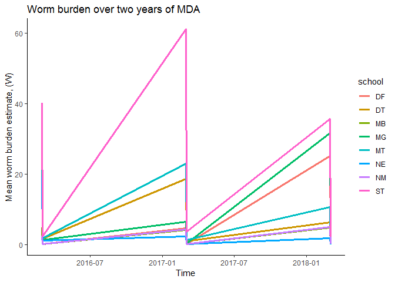
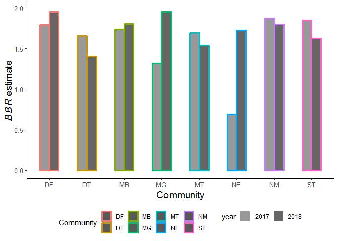
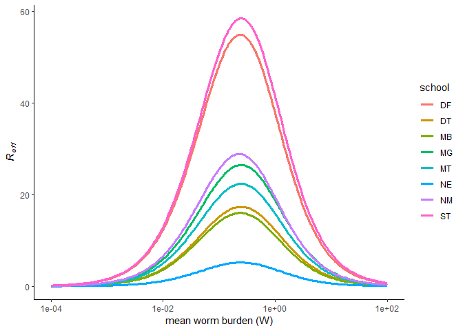
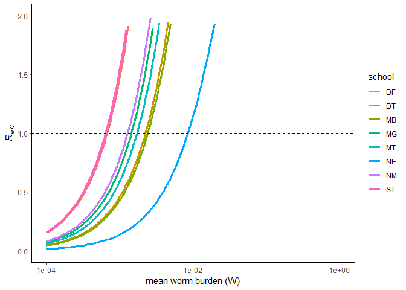

Model parameters from Senegal data
================

Community-level summaries of Senegal communities
================================================

``` r
sen_dat %>% 
  filter(var %in% c("w", "post") & school %in% ctrl_vils) %>% 
  mutate(date = case_when(var == "w" ~ as.Date(paste0(year, "-03-01")),
                          var == "post" ~ as.Date(paste0(year, "-03-02")) + 1)) %>% 
  ggplot(aes(x = date, y = value, col = school)) +
    geom_line(size = 1.2) +
    theme_classic() +
    labs(x = "Time",
         y = "Mean worm burden estimate, (W)",
         title = "Worm burden over two years of MDA")
```



``` r
sen_dat %>% 
  filter(var == "bbr" & school %in% ctrl_vils) %>% 
  ggplot(aes(x = school, y = value*365, fill = year, col = school)) +
    geom_bar(stat = "identity", 
             position = position_dodge(),
             width = 0.5,
             size = 1.2) +
    theme_classic() +
    theme(axis.text = element_text(size = 10),
          axis.title = element_text(size = 14),
          legend.position = "bottom") +
    scale_fill_manual(values = c("grey60", "grey40")) +
    #ylim(c(0,10)) +
    labs(x = "Community",
         y = expression(italic(BBR)~estimate),
         col = "Community")
```



``` r
sen_alphas <- sen_dat %>% 
  filter(var == "lambda" & school %in% ctrl_vils) %>% 
  mutate(alpha = value/(base_pars["omega"]*base_pars["theta"]*10)) %>% 
  group_by(school) %>% 
  summarise(alpha = mean(alpha))

comm_reff_profile <- function(comm){
  
  W_base = sen_dat %>% filter(school == comm & year == 2016 & var == "w") %>% pull(value)
  
  use_pars <- base_pars
  use_pars["alpha"] <- sen_alphas %>% filter(school == comm) %>% pull(alpha)
  fit_beta_Neq <- fit_pars_from_eq_vals(beta_guess = 2e-4, alpha_guess = 2e-4, Neq_guess = 1000, 
                                        W = W_base, Ip = 0.025, pars = use_pars)
  use_pars["beta"] <- fit_beta_Neq[1]
  
  reff_crv <- data.frame(W = exp_seq(1e-4, 100, 200)) %>% 
    mutate(Reff = sapply(W, Reff_W_kap, kap = 0.05, 
                         pars = use_pars)[1,],
           school = comm)
  
  return(reff_crv)
  
}

comm_reff_profiles <- bind_rows(lapply(ctrl_vils, comm_reff_profile))

comm_reff_profiles %>% 
  ggplot(aes(x = W, y = Reff, col = school)) +
    geom_line(size = 1.2) +
    theme_classic() +
    scale_x_continuous(trans = "log",
                       breaks = c(1e-4, 1e-2,1,100)) +
    labs(x = "mean worm burden (W)",
         y = expression(italic(R[eff])))
```



``` r
comm_reff_profiles %>% 
  ggplot(aes(x = W, y = Reff, col = school)) +
    geom_line(size = 1.2) +
    theme_classic() +
    ylim(c(0,2)) +
    geom_hline(yintercept = 1, lty = 2) +
    scale_x_continuous(trans = "log",
                       breaks = c(1e-4, 1e-2,1,100),
                       limits = c(1e-4, 1)) +
    labs(x = "mean worm burden (W)",
         y = expression(italic(R[eff])))
```

    ## Warning: Removed 1186 rows containing missing values (geom_path).


