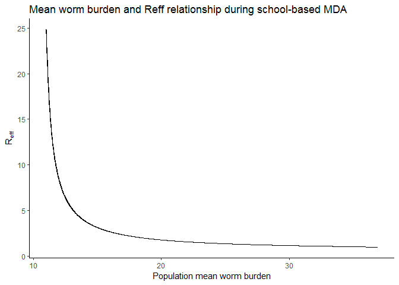
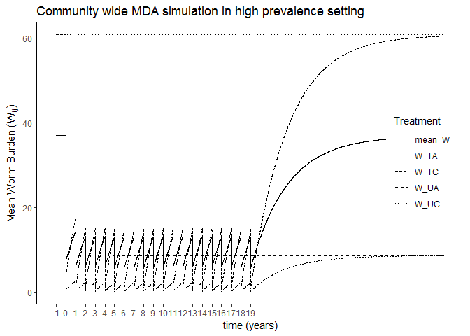
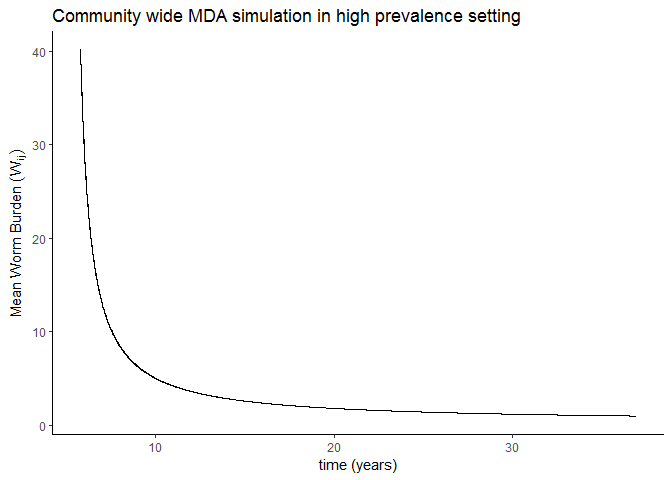
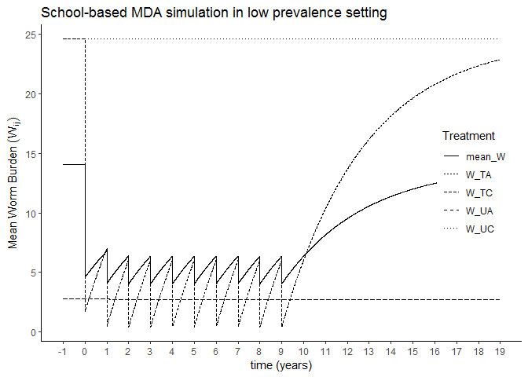
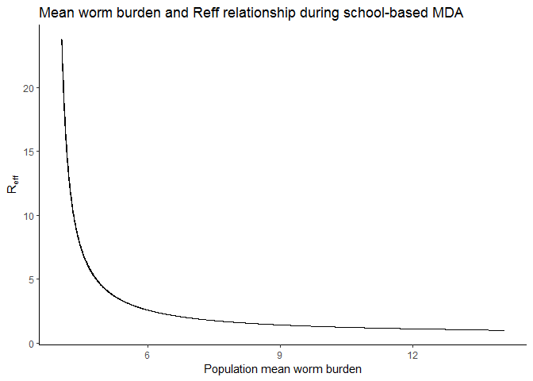
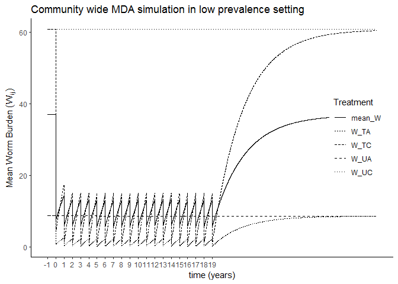

Age structured schistosomiasis model
================

Age structured model
====================

Simulations in high prevalence setting
--------------------------------------

``` r
# Egg burdens and prevalence from V1, tbales 6 and 7 https://doi.org/10.1186/s13071-016-1681-4 
C_est_V1 <- convert_burden_egg_to_worm(60, 0.1, 126, 0.71, age_strat_pars["m"], age_strat_pars["zeta"])
A_est_V1 <- convert_burden_egg_to_worm(10, 0.1, 19, 0.33, age_strat_pars["m"], age_strat_pars["zeta"])

V1_pars <- infection_inputs_get_pars(W_A = A_est_V1[1],
                                                kap_A = A_est_V1[2],
                                                H_A = 508,
                                                cvrg_A = 0,
                                                W_C = C_est_V1[1],
                                                kap_C = C_est_V1[2],
                                                H_C = 602,
                                                cvrg_C = 0.8,
                                                I_P = 0.1,
                                                age_strat_pars)

  Reff_Wij(V1_pars, C_est_V1[1], C_est_V1[1], A_est_V1[1], A_est_V1[1])
```

    ##      W_bar       Reff  Reff_W_TC  Reff_W_UC  Reff_W_TA  Reff_W_UA 
    ## 36.9499070  0.9903141  1.0000000  1.0000000  0.9788360  0.9788360

``` r
#Get equilibrium values of state variables
  eq_vals_V1 <- c(S=as.numeric(V1_pars["S_eq"]), 
               E=as.numeric(V1_pars["E_eq"]), 
               I=as.numeric(V1_pars["I_eq"]), 
               W_TC=C_est_V1[1], W_UC=C_est_V1[1], W_TA=A_est_V1[1], W_UA=A_est_V1[1])

#time frame of simulation  
  years <- 20
  age_time <- c(1:(365*years))

#create MDA events data frame  
  eff <- 0.93
  sac_mda <- data.frame(var = rep('W_TC', years/2),
                        time = c(1:(years/2))*365,
                        value = rep((1 - eff), years/2),
                        method = rep('mult', years/2))
```

### Simulate 10 years of annual MDA in 80% of SAC populaition

``` r
V1_SAC_mda_sim <- sim_schisto_mod(nstart = eq_vals_V1, 
                                   time = age_time, 
                                   model = schisto_age_strat_mod,
                                   pars = V1_pars,
                                   events_df = sac_mda) %>% 
  mutate(mean_W = (W_TC*V1_pars["h_tc"] +
                        W_UC*V1_pars["h_uc"] +
                        W_TA*V1_pars["h_ta"] + 
                        W_UA*V1_pars["h_ua"]),
         I_prev = I/(S+E+I),
         Reff = mapply(Reff_Wij, W_TC, W_UC, W_TA, W_UA, MoreArgs = list(pars = V1_pars))[2,])
```

    ## Warning in if (is.na(events_df)) {: the condition has length > 1 and only
    ## the first element will be used

``` r
V1_SAC_mda_sim %>% 
  gather("Treatment", "Worm Burden",  W_TC:mean_W) %>% 
  ggplot(aes(x = time, y = `Worm Burden`, lty = Treatment)) +
    geom_line() +
    theme_classic() +
    theme(legend.position = c(0.9,0.5)) +
    scale_x_continuous(breaks = c(0:years)*365,
                       labels = c(-1:(years-1))) +
    labs(x = "time (years)",
         y = expression(Mean~Worm~Burden~(W[ij])),
         title = "School-based MDA simulation in high prevalence setting")
```


``` r
V1_SAC_mda_sim %>% 
  ggplot(aes(x = mean_W, y = Reff)) +
    geom_line() +
    theme_classic() +
    labs(x = "Population mean worm burden",
         y = expression(R[eff]),
         title = "Mean worm burden and Reff relationship during school-based MDA")
```



So that makes it look like we're not even close to reaching the breakpoint and maybe haven't even reached *R*<sub>*p**e**a**k*</sub>. Let's increase coverage in SAC and add MDA in adult population and see what plot lokos like

### Simulate 20 years of annucal MDA in 90% SAC and 50% adult populations

``` r
#SAME SETUP ROUTINE 
#add transmission and other parameters to parameter set
V1_pars2 <- infection_inputs_get_pars(W_A = A_est_V1[1],
                                                 kap_A = A_est_V1[2],
                                                 H_A = 508,
                                                 cvrg_A = 0.5,
                                                 W_C = C_est_V1[1],
                                                 kap_C = C_est_V1[2],
                                                 H_C = 602,
                                                 cvrg_C = 0.9,
                                                 I_P = 0.1,
                                                 age_strat_pars)

#time frame of simulation  
  years40 <- 40
  age_time40yrs <- c(1:(365*years40))
    
    
#create MDA events data frame  
  eff <- 0.93
  com_mda <- data.frame(var = rep(c('W_TC', "W_TA"), years40/2),
                        time = rep(c(1:(years40/2))*365, each = 2),
                        value = rep((1 - eff), years40),
                        method = rep('mult', years40))

#MODEL RUN  
V1_CWT_mda_sim <- sim_schisto_mod(nstart = eq_vals_V1, 
                                   time = age_time40yrs, 
                                   model = schisto_age_strat_mod,
                                   pars = V1_pars2,
                                   events_df = com_mda) %>% 
  mutate(mean_W = (W_TC*V1_pars2["h_tc"] +
                        W_UC*V1_pars2["h_uc"] +
                        W_TA*V1_pars2["h_ta"] + 
                        W_UA*V1_pars2["h_ua"]),
         I_prev = I/(S+E+I),
         Reff = mapply(Reff_Wij, W_TC, W_UC, W_TA, W_UA, MoreArgs = list(pars = V1_pars2))[2,])
```

    ## Warning in if (is.na(events_df)) {: the condition has length > 1 and only
    ## the first element will be used

``` r
V1_CWT_mda_sim %>% 
  gather("Treatment", "Worm Burden",  W_TC:mean_W) %>% 
  ggplot(aes(x = time, y = `Worm Burden`, lty = Treatment)) +
    geom_line() +
    theme_classic() +
    theme(legend.position = c(0.9,0.5)) +
    scale_x_continuous(breaks = c(0:years)*365,
                       labels = c(-1:(years-1))) +
    labs(x = "time (years)",
         y = expression(Mean~Worm~Burden~(W[ij])),
         title = "Community wide MDA simulation in high prevalence setting")
```



Let's see if the expanded MDA did anything in terms of reaching the breakpoint

``` r
V1_CWT_mda_sim %>% 
  ggplot(aes(x = mean_W, y = Reff)) +
    geom_line() +
    theme_classic() +
    labs(x = "time (years)",
         y = expression(Mean~Worm~Burden~(W[ij])),
         title = "Community wide MDA simulation in high prevalence setting")
```



Simulations in low prevalence setting
-------------------------------------

``` r
# Egg burdens and prevalence from V12, tbales 6 and 7 https://doi.org/10.1186/s13071-016-1681-4 
C_est_V12 <- convert_burden_egg_to_worm(W_guess = 15, 
                                        kap_guess = 0.1, 
                                        egg_burden = 46, 
                                        prevalence = 0.23, 
                                        m = age_strat_pars["m"], zeta = age_strat_pars["zeta"])

A_est_V12 <- convert_burden_egg_to_worm(W_guess = 3, 
                                        kap_guess = 0.05, 
                                        egg_burden = 6, 
                                        prevalence = 0.12, 
                                        m = age_strat_pars["m"], zeta = age_strat_pars["zeta"])

V12_pars <- infection_inputs_get_pars(W_A = A_est_V12[1],
                                      kap_A = A_est_V12[2],
                                      H_A = 746,
                                      cvrg_A = 0,
                                      W_C = C_est_V12[1],
                                      kap_C = C_est_V12[2],
                                      H_C = 803,
                                      cvrg_C = 0.8,
                                      I_P = 0.1,
                                      age_strat_pars)

  Reff_Wij(V12_pars, C_est_V12[1], C_est_V12[1], A_est_V12[1], A_est_V12[1])
```

    ##      W_bar       Reff  Reff_W_TC  Reff_W_UC  Reff_W_TA  Reff_W_UA 
    ## 14.0811719  0.9898074  1.0000000  1.0000000  0.9788360  0.9788360

``` r
#Get equilibrium values of state variables
  eq_vals_V12 <- c(S=as.numeric(V12_pars["S_eq"]), 
                   E=as.numeric(V12_pars["E_eq"]), 
                   I=as.numeric(V12_pars["I_eq"]), 
                   W_TC=C_est_V12[1], W_UC=C_est_V12[1], W_TA=A_est_V12[1], W_UA=A_est_V12[1])
```

### 10 years of annual MDA in SAC population

``` r
V12_SAC_mda_sim <- sim_schisto_mod(nstart = eq_vals_V12, 
                                   time = age_time, 
                                   model = schisto_age_strat_mod,
                                   pars = V12_pars,
                                   events_df = sac_mda) %>% 
  mutate(mean_W = (W_TC*V12_pars["h_tc"] +
                     W_UC*V12_pars["h_uc"] +
                     W_TA*V12_pars["h_ta"] + 
                     W_UA*V12_pars["h_ua"]),
         I_prev = I/(S+E+I),
         Reff = mapply(Reff_Wij, W_TC, W_UC, W_TA, W_UA, MoreArgs = list(pars = V12_pars))[2,])
```

    ## Warning in if (is.na(events_df)) {: the condition has length > 1 and only
    ## the first element will be used

``` r
V12_SAC_mda_sim %>% 
  gather("Treatment", "Worm Burden",  W_TC:mean_W) %>% 
  ggplot(aes(x = time, y = `Worm Burden`, lty = Treatment)) +
    geom_line() +
    theme_classic() +
    theme(legend.position = c(0.9,0.5)) +
    #ylim(c(0,100)) +
    scale_x_continuous(breaks = c(0:years)*365,
                       labels = c(-1:(years-1))) +
    labs(x = "time (years)",
         y = expression(Mean~Worm~Burden~(W[ij])),
         title = "School-based MDA simulation in low prevalence setting")
```



``` r
V12_SAC_mda_sim %>% 
  ggplot(aes(x = mean_W, y = Reff)) +
    geom_line() +
    theme_classic() +
    labs(x = "Population mean worm burden",
         y = expression(R[eff]),
         title = "Mean worm burden and Reff relationship during school-based MDA")
```



### Simulate 20 years of annucal MDA in 90% SAC and 50% adult populations

``` r
#SAME SETUP ROUTINE 
#add transmission and other parameters to parameter set
V12_pars2 <- infection_inputs_get_pars(W_A = A_est_V12[1],
                                      kap_A = A_est_V12[2],
                                      H_A = 746,
                                      cvrg_A = 0.5,
                                      W_C = C_est_V12[1],
                                      kap_C = C_est_V12[2],
                                      H_C = 803,
                                      cvrg_C = 0.9,
                                      I_P = 0.1,
                                      age_strat_pars)

#MODEL RUN  
V12_CWT_mda_sim <- sim_schisto_mod(nstart = eq_vals_V12, 
                                   time = age_time40yrs, 
                                   model = schisto_age_strat_mod,
                                   pars = V12_pars2,
                                   events_df = com_mda) %>% 
  mutate(mean_W = (W_TC*V1_pars2["h_tc"] +
                        W_UC*V1_pars2["h_uc"] +
                        W_TA*V1_pars2["h_ta"] + 
                        W_UA*V1_pars2["h_ua"]),
         I_prev = I/(S+E+I),
         Reff = mapply(Reff_Wij, W_TC, W_UC, W_TA, W_UA, MoreArgs = list(pars = V12_pars2))[2,])
```

    ## Warning in if (is.na(events_df)) {: the condition has length > 1 and only
    ## the first element will be used

``` r
V1_CWT_mda_sim %>% 
  gather("Treatment", "Worm Burden",  W_TC:mean_W) %>% 
  ggplot(aes(x = time, y = `Worm Burden`, lty = Treatment)) +
    geom_line() +
    theme_classic() +
    theme(legend.position = c(0.9,0.5)) +
    scale_x_continuous(breaks = c(0:years)*365,
                       labels = c(-1:(years-1))) +
    labs(x = "time (years)",
         y = expression(Mean~Worm~Burden~(W[ij])),
         title = "Community wide MDA simulation in low prevalence setting")
```


